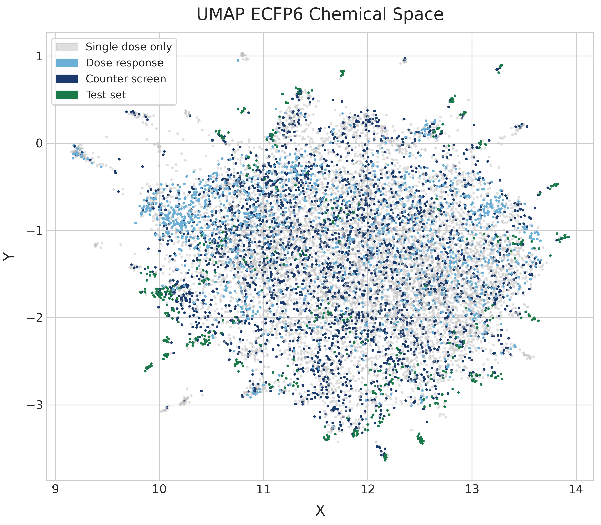
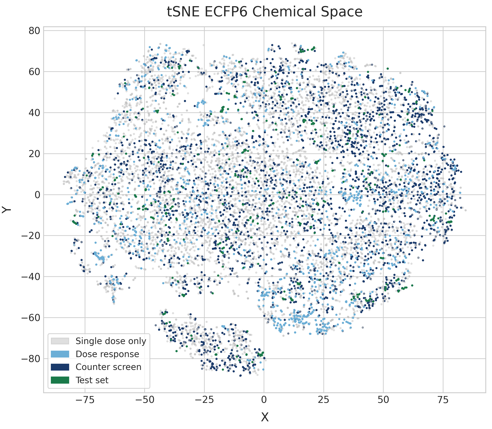
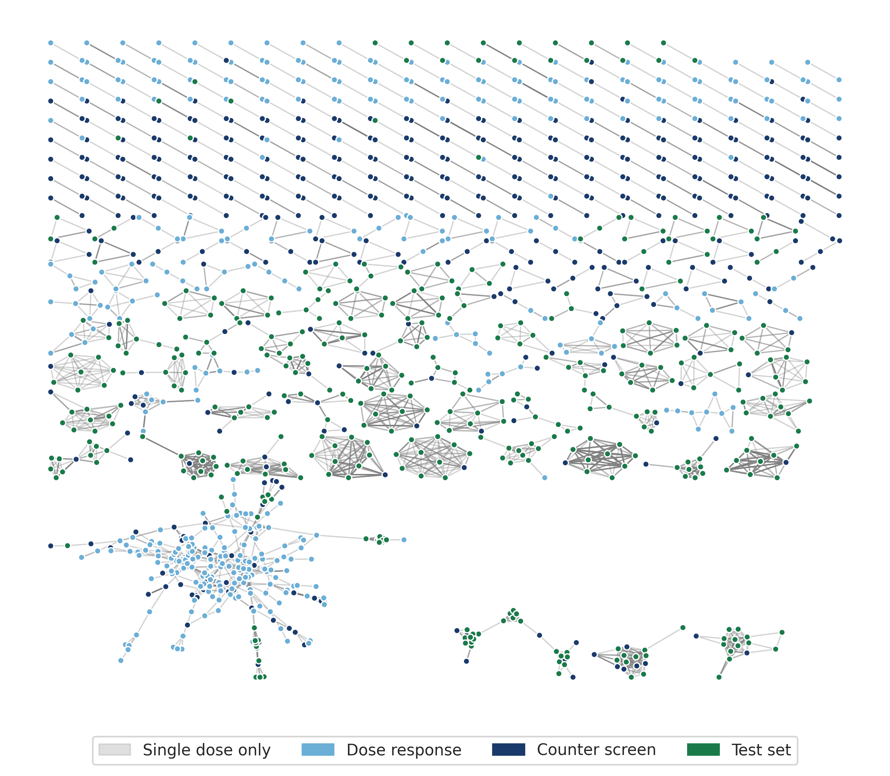
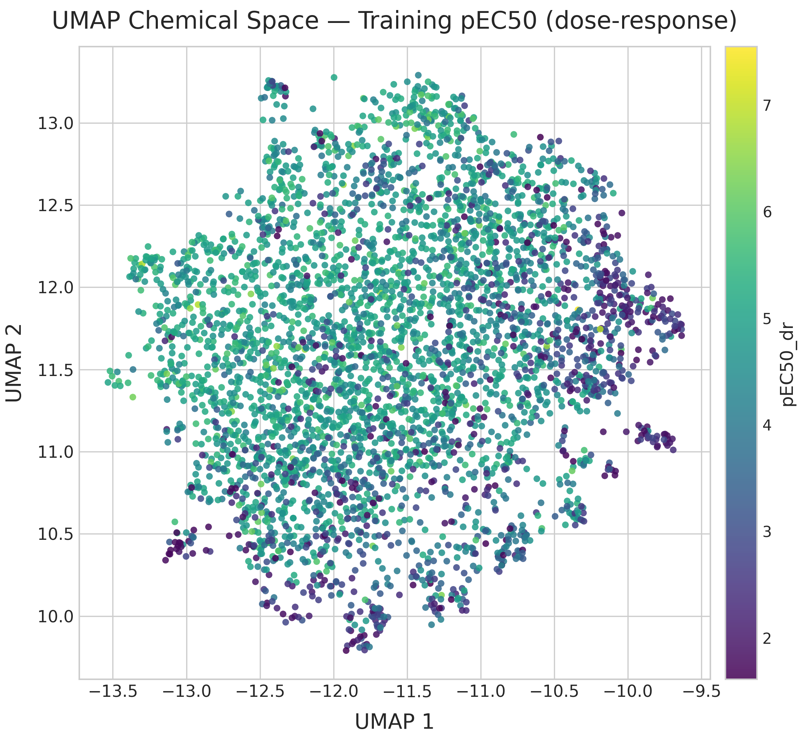
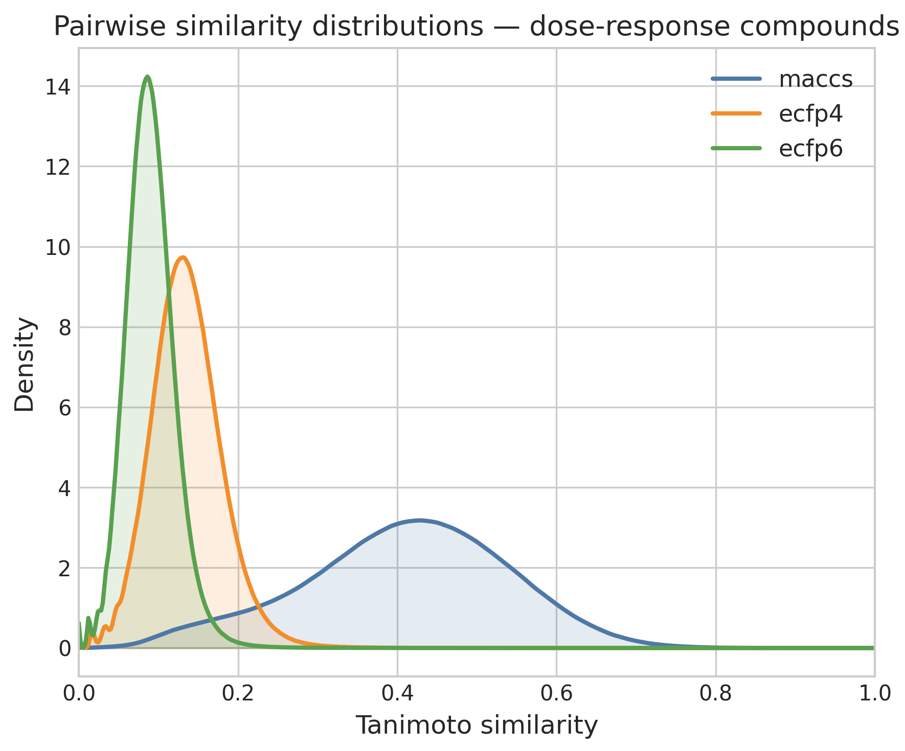
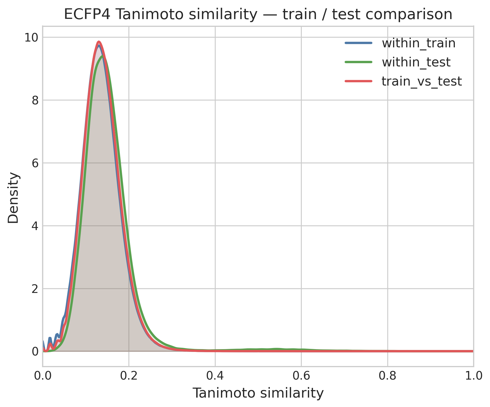

# PXR challenge #1: Exploring the data

Whenever you start a new project, it is always good to familiarize yourself with the data.
In the previous post, we briefly checked the overlap of compounds between the datasets, but barely looked at chemical structures or activity patterns.
In this post, we will get an overview of the chemical space across the four datasets and explore in detail the activity distribution within this space.
The main questions to answer in this analysis are:
- how diverse is the chemical space? 
- How widespread is PXR induction within the chemical space?
- What is the SAR character of the data (is it discontinuous)?
- Are there broad chemical series that can be extracted from the data?

---

## A note about the code

My plan was to generate one marimo notebook for each post and make each notebook standalone.
However, as I kept expanding the scope of the analysis, it became increasingly cumbersome to work within one really large notebook.
So I decided to split the code into five notebooks as detailed below. 
On the one hand, I think this makes the notebooks easier to follow. 
On the other hand, it means some duplicated code as I wanted to keep the notebook portable.
In a normal project, I would just have made a folder with common scripts and functions to be called within the notebooks. 
For each notebook, I provide a link to the python file in my [pxr_challenge repository](https://github.com/adlvdl/pxr_challenge) as well as HTML exports of the notebooks that allow some exploration of the data tables and plots.

---

## Data preprocessing

The first [notebook 1a](https://github.com/adlvdl/pxr_challenge/blob/main/marimo_notebooks/1a_data_preprocessing.py) ([html](../html_notebooks/pxr_challenge/1a_data_preprocessing.html)) reads the latest HuggingFace datasets (those updated on April 9th) and generates a set of processed datasets.
The first derived dataset contains all compounds across the single dose screen, dose response screen, counter screen and test dataset.
I make sure to normalize chemical structure using InChIKeys (somewhat against the advice of the OpenADMET organizers who recommend organizing data by Molecule Name or OCNT Batch ID) so each row represents one chemical structure. 
In this step I discard several columns that are present in each dataset and keep only those columns that I think I might potentially use for filtering and modeling in subsequent notebooks.

From the single dose, I keep the median log₂FC value and whether it is considered a hit at the given concentration (a hit is defined by median log₂FC > 1 and FDR-BH < 0.05). 
I keep these two properties for all four concentrations present in the single dose dataset, even though the 1uM and 100uM concentrations have much fewer data points than 30uM and 10uM. 
For the dose response and counter screen I keep only the pEC50 and "Emax_estimate (log2FC vs. baseline)" values.
The test set compounds obviously only have IDs and chemical structure.

Once I had a file with all unique chemical structures across the four datasets, I computed all potential matched molecular pairs (MMPs) using mmpdb. 
MMPs are two molecules that share a large common substructure and differ only at a single point (either central or terminal). 
Because of that, they are a very intuitive way to identify similar pairs of compounds.

Both the activity dataset and the MMP dataset are used in the following notebooks.

---

## Chemical Space Exploration

In [notebook 1b](https://github.com/adlvdl/pxr_challenge/blob/main/marimo_notebooks/1b_chemical_space_and_mmp.py) ([html](../html_notebooks/pxr_challenge/1b_chemical_space_and_mmp.html)), we provide an overview of the chemical space. 
This can be done in many different ways and generally depends on a molecular representation or fingerprint and a similarity metric.

Two types of visualizations of chemical space are demonstrated:
- chemical embeddings
- similarity networks

### UMAP and t-SNE embeddings

Chemical embeddings are scatterplots where each point is a molecule and its X and Y position depends on its chemical structure. 
This can be done using dimensionality reduction techniques like t-SNE or UMAP on a given fingerprint. 
I decided to use an ECFP6 fingerprint as basis for the t-SNE and UMAP plots.
Often the coloring scheme in these visualizations is based on the value of some biological property like activity. 
However, in our examples the coloring is based on dataset.

The UMAP reveals a single, broadly dispersed cloud with no strong cluster separation. The absence of tight, well-separated clusters indicates **high chemical diversity without dominant scaffold families**. Dose-response compounds (light blue) and counter-screen compounds (dark blue) are distributed throughout the same space as the single-dose compounds (gray). 
This could suggest that PXR induction is fairly well distributed across the chemical space, but no pEC50 values are shown here. 
We might see in future plots that high activity is limited to small parts of the chemical space.
The test set (dark green) is similarly distributed across the embedding.
While they tend to appear as small clusters, these clusters are distributed widely and suggest that test compounds are also structurally diverse.

The t-SNE embedding shows very similar patterns to the UMAP plot.
t-SNE plots tend to be more space-filling than UMAP plots at default parameters, but because there is no high level structure to the diversity of the dataset they both end up very diffuse.

I also show in the last cell of the notebook an interactive plot of the chemical space colored based on pEC50 values on the dose response screen. 
I also highlight in red test compounds. 
Sadly, the html notebook exported from marimo is not able to show the chemical structure of the hovered data point. 
But if you run the notebook yourself, you will be able to easily get an idea of the chemical structures present in the different datasets.

The interactive plot helps to show that PXR induction at uM level is widely distributed across the chemical space.
There are clusters of mostly low-activity compounds in several sections of the plot.
The coloring scheme used here also highlights better than the other plots that test compounds (in red) are found all over the chemical space in our data.

### Similarity networks

Similarity networks are graphs where each node is a molecule and edges connect "similar" molecules. 
As I mentioned before, how we define similarity can be very different. 
Here I use MMPs, although I filter the MMPs calculated by mmpdb so that the common core in an MMP is larger than the variable section. 
In datasets that are less diverse, I would be more strict when filtering MMPs, but the number of MMPs is small enough even with this loose filter. 

Once you have your graph, you use a layout algorithm like Fruchtermann-Reingold to calculate the X and Y positions of each node. 
The idea is to pull connected nodes closer together and push unconnected ones apart. 

The MMP network is fragmented: one large hub cluster, several medium clusters, and many isolated pairs. 
The large, diffuse grid-like region should represent compounds with single-substituent changes at common positions, like systematic analogues sharing a common core. 
However in this case it seems to be an artifact, as compounds in the largest connected component are small molecules with one or small number of small rings. 
Test-set compounds (green) appear in several clusters alongside training compounds, showing many similarity relationships between training and test set.

### pEC50 landscape across chemical space

The UMAP of dose-response compounds colored by pEC50 (recomputed on this subset to maximize structural resolution) shows that high-potency compounds (pEC50 > 6) are **scattered throughout chemical space** rather than concentrated in one region. Multiple chemotypes contribute to activity; global structural similarity to known actives is a poor proxy for potency.

---

## Activity Cliffs

Activity cliffs (ACs) are pairs of structurally similar compounds with large differences in biological activity. 
They are the most information-dense SAR signal in the dataset and the hardest prediction targets.
Datasets with large number of activity cliffs are sometimes called SAR discontinuous, and they are generally harder to model than datasets with low number of activity cliffs. 
The main complexity of AC analysis is how to define them. 
We go back to needing to separate compounds into pairs that are similar from those that are not. 
Here I compute ACs based on MMPs and different fingerprint representations. 
The code can be found in [notebook 1c](https://github.com/adlvdl/pxr_challenge/blob/main/marimo_notebooks/1c_activity_cliffs.py) ([html](../html_notebooks/pxr_challenge/1c_activity_cliffs.html)).

### MMP-based cliffs

Applying |ΔpEC50| ≥ 2 to the 1,503 MMP pairs within the dose-response set identifies **60 activity cliff pairs** — 7.7% of MMP-connected compounds. 
The number of MMP cliffs is very low, but it is not surprising considering the low number of MMPs we have in the dataset.

### Fingerprint-based cliffs and fingerprint dependence

Computing similarity based on chemical fingerprints has a long history in chemoinformatics. 
Similar to our discussion on the chemical embedding section, the choice of fingerprint and similarity metrics has a large impact on the analysis. 
It is important to be aware that the distribution of similarity values will differ from fingerprint to fingerprint, even when the differences between them (folding ECFP4 to 1k or 4k bits) are small.

Based on my experience and the literature on the topic, I frequently use rule of thumb thresholds of similarity values to define similar pairs. 
For MACCS it's Tanimoto ≥ 0.8 and for ECFP4 it's Tanimoto ≥ 0.4.
The number of ACs calculated from each fingerprint varies, but it generally hovers around 8% of similar pairs. 
This value is similar also to the one from MMP cliffs. 
However, while the number is similar the exact pairs identified are often different.

The Venn diagram of MACCS- and ECFP4-defined cliff pairs reveals that the two fingerprints identify largely non-overlapping sets of activity cliffs. 
Only a small fraction of pairs (~10 out of cumulatively > 500 cliffs) are identified as cliffs by both criteria. 
These consensus cliffs are a way to generalize the AC analysis across different representations.

---

## Train–test similarity comparison

In this section ([notebook 1d](https://github.com/adlvdl/pxr_challenge/blob/main/marimo_notebooks/1d_train_test_exploration.py) — [html](../html_notebooks/pxr_challenge/1d_train_test_exploration.html)) I look in more detail at the similarity patterns between training and test set. 
My idea was to test how distinct test compounds are from training compounds. 
For that I compared the similarity value distribution within the training and test set, and between compounds of the train and test set.

The three distributions are overlaid: within-train, within-test, and train-vs-test (cross-set) ECFP4 Tanimoto similarities. 
All three are very similar, peaking near Tanimoto = 0.12–0.15. **The test set seems indistinguishable from the training set in structural diversity and coverage.** 

The next analysis looks at the similarity value distribution between training and test set to extract, for each test set compound, its nearest neighbor (NN) in the training set. 
The majority of the test compounds have a NN in the train set that can be considered highly similar (ECFP4 Tanimoto similarity > 0.4). 

As the final analysis I recreate a plot shown in the example notebook for the PXR activity submission, comparing dose response pEC50 to counter screen pEC50 values. 
Based on this plot, training compounds can be divided into:
- Not tested in counter screen
- Non selective: ΔpEC50_DR − counter <= 1.5
- Selective: ΔpEC50_DR − counter > 1.5
- Hit: selective and pEC50_DR ≥ 6

Based on these definitions, we looked at what type of training compounds were the NN of the test set compounds.

The majority of test compounds have NNs that are classified as selective or hits. 
The fraction classified as "Not tested" in the counter screen is small, meaning the training data provides selectivity context for most of the chemical space the test set probes. 
I was surprised at the data as I had expected the hits to be more predominant. 
This may reflect that the test set was assembled from a broader analogue pool, focusing more on exploration than exploitation of highly active and selective compounds. 
On the other hand, this could also be an artifact. 
It could happen that an analog of a hit compound is identified within a commercially available compound set that has a NN that is different within our dataset. 
This issue can often appear when you are trying retrospectively to assess a decisions on compound sets using only the output. 
Without additional data, it is not possible to be sure what the basis was for each test set compound to be chosen.

---

## Scaffold Analysis

In the final section ([notebook 1e](https://github.com/adlvdl/pxr_challenge/blob/main/marimo_notebooks/1e_scaffold_analysis.py) — [html](../html_notebooks/pxr_challenge/1e_scaffold_analysis.html)) I look in more detail at the structural variety of the dataset. 
I performed a scaffold decomposition similar to the one done in a [scaffold tree](https://pubs.acs.org/doi/10.1021/ci600338x).
I was interested not in the topology of the nodes in a scaffold, but in the frequency of occurrence of Bemis-Murcko scaffolds, linked ring systems and individual ring systems, which together I call substructures for lack of a better word. 
I used this data to analyze and visualize the structural overlap between the training and test set. 
In this type of analysis, I am always interested to find large substructures (in terms of number of heavy atoms) that are present in large number of compounds, as they can provide data-derived chemical series to cluster and classify the data. 

The plot comparing substructures between the training and test set finally killed a misconception I had about the test dataset. 
As I had seen them called analog sets, my mind went directly to analog series. 
I was expecting the test set to be based on one or a small number of unique scaffolds, using a small set of hit compounds as reference.
That is not the case. 
Although, the test set molecules are highly similar to at least one compound in the training set, they are themselves fairly diverse.

---

## Conclusion

So to conclude let's go back to the questions I originally posed:
- How diverse is the chemical space? Very diverse. Some parts were not surprising (considering the single dose dataset came from diverse libraries) but I didn't expect the test set to be as diverse as it is. I think that will make prediction harder. 

- How widespread is PXR induction within the chemical space? The pEC50 values in the training set are generally lower (values between 2 to 7) than you often see in ChEMBL, but this is expected as we're looking at unoptimized molecules. I was surprised that uM activity was found pretty much over the whole chemical space. 

- What is the SAR character of the data (is it discontinuous)? I would say mildly discontinuous. We did find activity cliffs, but their propensity across similar pairs of compounds (12%-6%) is not massive. 

- Are there broad chemical series that can be extracted from the data? No, I was not able to find substructures or scaffolds that would help organize the chemical space into a small number of chemical series. 

Overall, I expect the modeling to be challenging, and I heard similar from other participants in the Discord chat. 
Next step will to be explore data splits, train baseline and single task models and generate my first submission so at least I have some predictions ready for the mid challenge unblinding of part of the test set.

