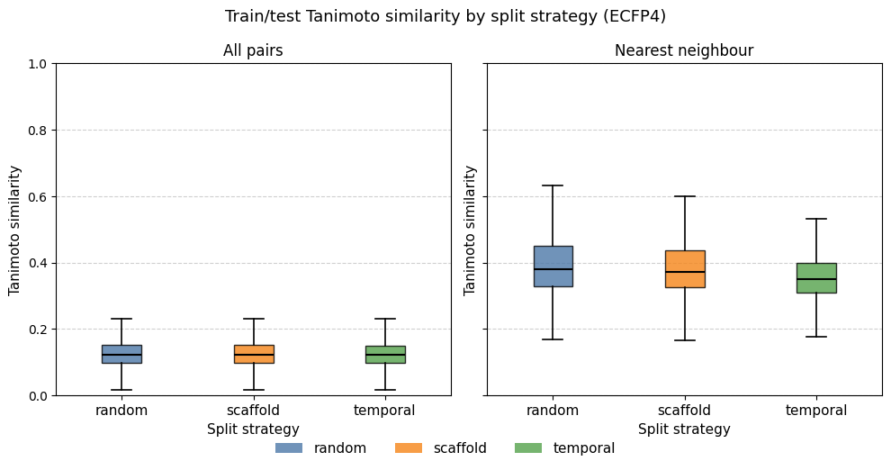
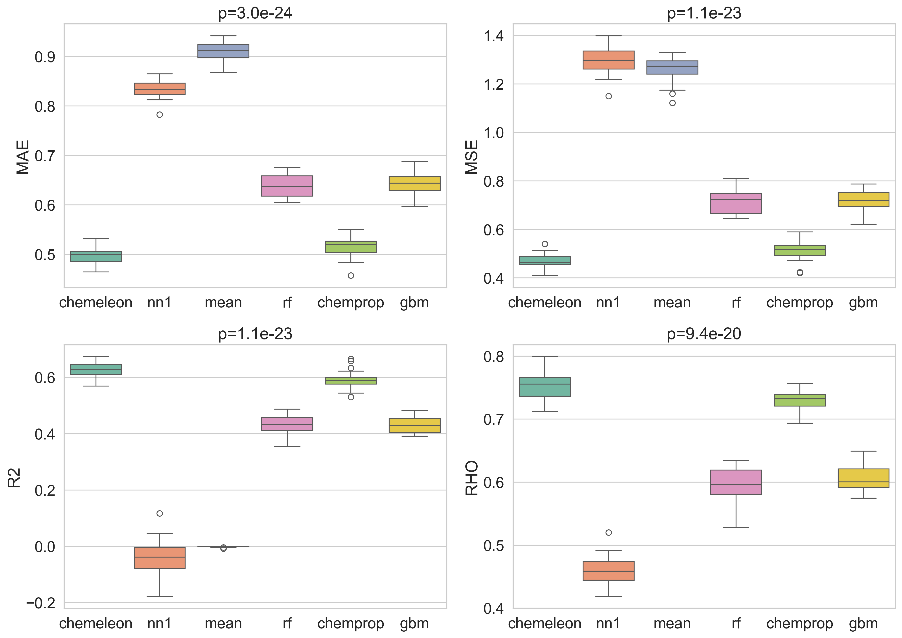

# PXR Challenge #2: Training and Comparing ML Baseline Models

*April 2026*

---

This is the third post in the PXR challenge series. 
The [previous post](2026_04_15_pxr_sar_exploration.html) explored the dataset looking for structure-activity relationship patterns. 
In this post I start modeling: I compare different data splitting techniques, train different ML models, evaluate them with a rigorous statistical framework, and submit the best model's predictions to the leaderboard.

The full notebook is available as [an interactive HTML export](../html_notebooks/2_ml_baseline.html) and the source code is on [GitHub](https://github.com/adlvdl/pxr_challenge).

---

## Part 1 — Comparing Data Split Strategies

Splitting the data is the first part of any ML modeling workflow, because **performance results must be assessed using data not seen during training**. 
In most cases you want to split the data into three sets: 
- training: this data will be used to update the state of an ML model (weights, trees, etc...)
- validation: this data will be used to assist the training of an ML model (for example, you can use performance on the validation set to guide early stopping of a model)
- test: this data is never used during training, it is used by a trained model to provide predictions on new data

While the basics are simple, the devil hides in the details. 
You can do a simple split of the data into three sets, or you can perform a cross-validation (CV) experiment where you chunk the data into N sets, where one set is the test set and the other chunks comprise the training and validation sets. 
Moreover, you need to decide by what criteria you split the data. 
Ideally you want to **split the data in such a way to gain a realistic estimate of how your model will perform on new data you will obtain in the future**. 
This is not always easy to assess retrospectively. 
In general, the literature suggests that random splits provide an optimistic assessment of the model, while scaffold and temporal splits (explained below) are more realistic or pessimistic.

I implemented the three splitting strategies and measured their difficulty using **train/test Tanimoto similarity** distributions (ECFP4, radius 2, 2048 bits) across one round of 5-fold CV.

| Strategy | What it tests |
|---|---|
| **Random** | Baseline — molecules are shuffled at random across folds |
| **Scaffold** | Chemical generalization — folds split by Bemis–Murcko scaffold so the model never sees a scaffold at test time that it trained on |
| **Temporal** | Prospective generalization — molecules ordered by their numeric ID, used as a proxy for acquisition order |

For each fold and each split method I computed two similarity views:

- **All pairs** — every (test compound, train compound) Tanimoto value; captures the full distributional picture
- **Nearest neighbor (NN)** — only the maximum similarity per test compound; directly measures how close each prediction will be to training data

The results are striking in how *similar* the three strategies are. 
All three distributions peak around Tanimoto 0.15–0.20 in the all-pairs view, with nearest-neighbor medians between 0.35 and 0.45. 
The temporal splits show only a modest leftward shift relative to the random split.

This result is consistent with the structural analysis from post #1: the dose-response set is highly diverse, with the majority of Bemis–Murcko scaffolds represented by only one or two compounds. 
When the dataset is so diverse, scaffold-based splitting degrades to near-random splitting. 
There are too few large scaffold families to isolate. 

While a temporal split is traditionally considered a more realistic and pessimistic split,
it assumes data originates from a cyclical process — a series of DMTL (Design, Make, Test, Learn) cycles — where later entries expand and learn from previous ones.
That is not the case here, as the training set is largely a subset of a screening library. 
In addition, I made the assumption that progression in ID number could have a temporal character, which might be wrong. 
Nonetheless, there is a small shift to lower similarity values, seen especially in the NN plot.
If I wanted to examine this in more detail, I would check whether the training compounds
that were not in the single-dose set have ID numbers after those of the single-dose compounds.
That might explain the slight shift.

For a genuinely challenging structure-based split one would instead cluster the full dataset (e.g. by hierarchical clustering or Butina clustering on ECFP4) and hold out entire clusters. 
Given the near-identical distributions, **I proceed with random CV for all subsequent model comparisons**. 
It is the simplest strategy and the similarity analysis suggests it is unlikely to give meaningfully different results than the other splits.

---

## Part 2 — Models

I compared four machine learning models and two simple baseline models.  

| Model | Backend | Input |
|---|---|---|
| `MeanBaseline` | Predict the training-set mean for every compound | None |
| `NearestNeighborBaseline` | Predict the label of the most similar training compound (1-NN, Tanimoto) | ECFP fingerprint |
| `RandomForestModel` | scikit-learn Random Forest Regressor | ECFP fingerprint |
| `BoostedTreesModel` | XGBoost Regressor with early stopping | ECFP fingerprint |
| `ChempropModel` | Chemprop v2 D-MPNN trained from scratch | SMILES |
| `ChempropChemeleonModel` | Chemprop v2 fine-tuned from the [CheMeleon](https://github.com/JacksonBurns/chemeleon) weights | SMILES |

The two baselines serve as lower bounds rather than real competitors. 
The **mean baseline** should produce by definition R² = 0 and an undefined Spearman ρ — it tells us the worst-case MAE we could achieve with no structural information guiding the prediction. 
The **nearest-neighbor baseline** is a useful sanity check: if a model with learned representations cannot beat 1-NN retrieval, something is wrong. 
It is the simplest model in which structural information from the training set guides the prediction in the test set.

All fingerprint-based models used **ECFP4** (radius 2, 2048 bits). 
A 10 % validation split was carved from each training fold for XGBoost and Chemprop early stopping (50 epoch maximum).

---

## Part 3 — Model comparison

A common mistake in ML benchmarking is ranking models by their mean metric across folds and treating the order as meaningful without assessing whether differences are statistically significant. The key problem is that folds are shared across models — the same train/test split is seen by every model — creating a repeated-measures structure that ordinary t-tests ignore and that inflates false-positive rates.

Many scientific papers, when comparing ML models, simply provide a table of metrics calculated from one split of the dataset. 
Such a comparison is likely to hide stochastic effects that most ML models have during training, like initialization conditions. 
For a long time I would train ten different models using different seeds to account for these types of stochastic effects. 
A [recent publication](https://pubs.acs.org/doi/10.1021/acs.jcim.5c01609) showed a more rigorous method to compare ML models.

In this analysis, I followed the approach they shared, adapting code from [polaris-hub/polaris-method-comparison](https://github.com/polaris-hub/polaris-method-comparison).
I ran **5 × 5 nested cross-validation** (5 outer × 5 inner folds, 25 folds total) using random splitting. 
The target column is `pEC50_dr` — the dose-response pEC50 from the primary assay, the same quantity submitted to the challenge leaderboard.
Training all six models across 25 folds took approximately **7 hours** on a base M4 Mac Mini (the CheMeleon models dominated the wall time).

The 5 x 5 CV method provides 5 approximately independent predictions for each data point in the dataset. 
I first computed MAE, MSE, R², and Spearman ρ for each (fold, model) pair.
In the example on the Polaris repo they also compute classification metrics like precision, recall by providing a threshold value that separates positive and negative instances. 
However, I always prefer to assess a regression model with regression metrics. 
If a meaningful threshold exists, it is better to transform the labels and train a classification model. 

### Step 1 — Scatter plots: predicted vs measured

One of the first things to do to assess a ML model is to compare predicted vs observed values. 
Each panel shows one model's predictions pooled across all 25 folds. 
The dashed diagonal is the identity line; red dashed lines mark the pEC50 = 4.0 activity threshold used for precision/recall. 
Metric values shown are fold-averaged.

The mean baseline produces the expected horizontal stripe at the training mean (~4.3). 
The nearest-neighbor baseline spreads predictions more but shows considerable noise — the predicted–measured correlation is low, consistent with the high structural diversity discussed in post #1. 
The fingerprint-based models (RF, XGBoost) produce noticeably tighter clouds, and the MPNN-based models (Chemprop, CheMeleon) are tighter still. 
CheMeleon's scatter is visibly closest to the diagonal.

Another thing is visible in the scatterplots, especially in the Chemprop and CheMeleon ones. 
There is a band of data at the lowest value of observed activity (pEC50 < 2) with a large spread of predicted values (generally between 2 and 5). 
In the past I have seen this pattern with assay data that has a threshold effect, where compounds tested are outside the detection range of the assay. 
Those data points are normally reported as > X or < M, but can often end up in datasets without the qualifier. 

### Step 2 — Normality diagnostics

One important aspect of the downstream statistical analysis is to check whether the 25x6 metric values computed across models and folds follow a normal distribution.

The residuals are reasonably bell-shaped for MAE and R² but show mildly heavy tails for MSE and ρ. 
The Q–Q plots confirm approximate normality for MAE and R², with some deviation at the extremes. 
I proceed with the analysis assuming parametric tests are valid.

### Step 3 — Boxplots with repeated-measures ANOVA p-values

Each box shows the cross-fold distribution of a metric for one model. 
The panel title reports the **repeated-measures ANOVA p-value** — the probability of observing differences this large if all models were equivalent, after accounting for the shared-fold structure.

Three metrics yield p < 0.05, confirming that the models are not statistically equivalent. 
Rho values provide no p-value because the metric is undefined when the variance of the predictions is zero, as it happens in the mean baseline where all values are the same. 
The ordering is consistent across metrics: CheMeleon best, then Chemprop, then RF and XGBoost, with the two baselines at the bottom. 

I also computed the non-parametric boxplots as a cross-check.

The results are visually very similar, which is what I would expect from the normality analysis I did in the previous step. 
If the values and figures show marked differences, I generally prefer to go with the nonparametric results.

### Step 4 — Multiple-comparison heatmaps

In the next step I performed the Tukey HSD test and showed the results as a series of heatmaps. 
Each cell shows the mean difference between two different models. 
Color encodes direction and magnitude of the effect size; significance stars follow the standard convention (*** p < 0.001, ** p < 0.01, * p < 0.05).

For metrics to **maximize** (R², ρ) red colors mean the row model is better; for metrics to **minimize** (MAE, MSE) the colormap is reversed so red colors still mean the row model is better.

The heatmaps make the pairwise story concrete:

- **CheMeleon** is significantly better than every other model across all four metrics — the top row is uniformly warm.
- **Chemprop** beats RF and XGBoost across all metrics.
- **XGBoost** beats RF only on ρ; the other three metrics are not significant.
- **MeanBaseline** and **NearestNeighborBaseline** are dramatically worse, as expected. The mean baseline achieves R² = 0 by construction; its ρ is undefined (NaN, displayed as 0 here). The mean baseline's worst-case MAE was **0.91** (predictions off by nearly one order of magnitude on average). The NN model has better MAE values though its R² was slightly negative, meaning it is marginally worse than predicting the mean.

---

## Part 5 — Final Model and Submission

Based on the CV results, I trained a **CheMeleon model on the entire dose-response training set** (4,138 compounds) and predicted the 513 held-out test compounds.

A 10 % random validation split (415 compounds) was drawn from the training data for early stopping — this is not the competition test set. 
The model was trained for up to 50 epochs, with the best checkpoint selected by validation loss.

The submission was prepared in the format required by the challenge validator and it passed all validation checks (513 rows, no missing identifiers, all pEC50 values numeric and finite).

### Leaderboard results

At the time of submission, I was **rank 57 of 84**, just above the LightGBM baseline provided by OpenADMET.
The table below compares the performance values shown in the leaderboard to the ones I saw for CheMeleon in the 5x5 CV test.

| Set | MAE | R² | ρ |
|---|---|---|---|
| 5×5 CV (random) | 0.50 | 0.62 | 0.75 |
| Leaderboard test | 0.574 | 0.336 | 0.708 |

The gap between CV and test performance is larger than the inter-fold variance within CV would predict. 
Of particular note is R², which falls from 0.62 to 0.34. 
MAE and ρ degrade more moderately. 
These results suggest to me that there are meaningful differences in the distribution of activity values between the CV and test sets, either in the predicted or observed distributions.
I compared the distribution of CheMeleon pEC50 values within the CV experiment to the predictions of the test set. 
The results are shown in this table:

| Stat    | CV y_pred | CV y_true | Test submission |
|---------|-----------|-----------|-----------------|
| n       | 20,690    | 20,690    | 513             |
| mean    | 4.341     | 4.322     | 5.102           |
| std     | 0.930     | 1.121     | 0.651           |
| min     | 0.951     | 1.610     | 2.671           |
| p25     | 3.793     | 3.640     | 4.762           |
| median  | 4.629     | 4.650     | 5.193           |
| p75     | 5.025     | 5.130     | 5.583           |
| max     | 6.933     | 7.549     | 6.444           |

The test submission is shifted ~0.76 log units higher than the CV predictions (mean 5.10 vs 4.34) and is much narrower (std 0.65 vs 0.93 in CV). 
This is not necessarily a bad thing. 
Test compounds were generally similar to active and selective compounds in the training set as I showed in the previous post.
That would explain their higher mean and narrower range of predicted values compared to the whole training dataset.

It is worth emphasizing that this result was **expected**: no hyperparameter optimization, feature engineering, or ensemble methods were applied. 
The CheMeleon model was run with default settings and a fixed 50-epoch budget. 
The primary goal of this notebook was to establish a reproducible statistical comparison framework and a clean prediction baseline, not to chase leaderboard rank.

---

## Summary and Next Steps

This notebook established three things:

1. **Data split strategy matters less than expected** for this dataset. 
The high structural diversity of the dose-response set means scaffold and temporal splits produce nearly the same train/test similarity distributions as a random split. 
A clustering-based split would be needed to create a genuinely hard out-of-distribution benchmark.

2. **MPNN-based models with pretrained initialization outperform fingerprint-based models** significantly and consistently. 
CheMeleon > Chemprop > XGBoost ≈ RF, with all differences except XGBoost vs. RF reaching statistical significance. 
One test I plan to do in the future is to check how much of CheMeleon's advantage over Chemprop comes from pretraining and how much comes from a wider hidden layer.

3. **A rigorous statistical framework prevents overconfident conclusions.** 
The repeated-measures ANOVA / Friedman / Tukey HSD pipeline correctly identifies that RF and XGBoost are not significantly different on most metrics, while simpler mean comparisons would suggest XGBoost is consistently better.

In the next few notebooks and posts I will be testing different strategies to increase model performance. 
Some of the possibilities to consider:

- Hyperparameter optimization for CheMeleon (learning rate, epochs, batch size)
- Multi-task learning using the counter-screen pEC50 and/or Emax values
- Pretraining models with the single dose dataset
- Ensemble methods combining CheMeleon with fingerprint-based models

