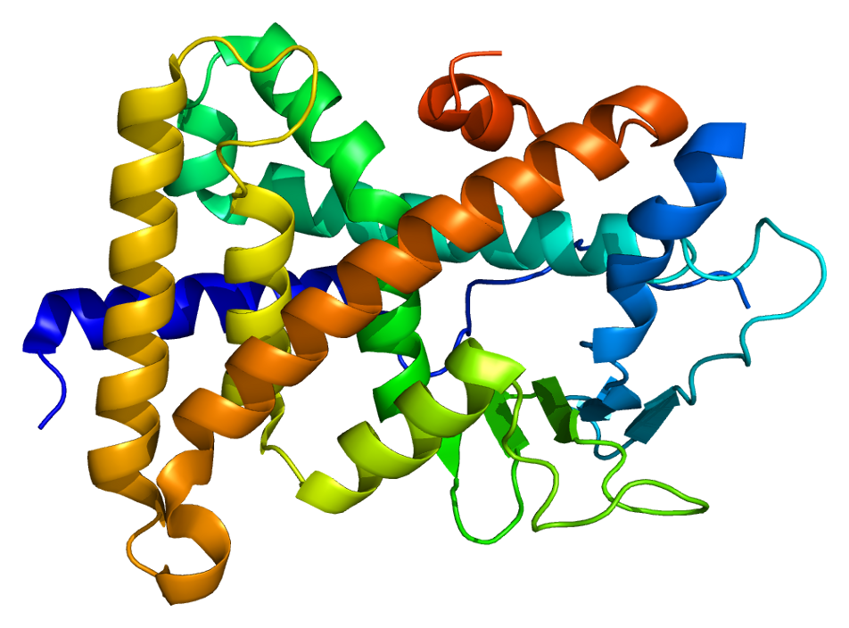
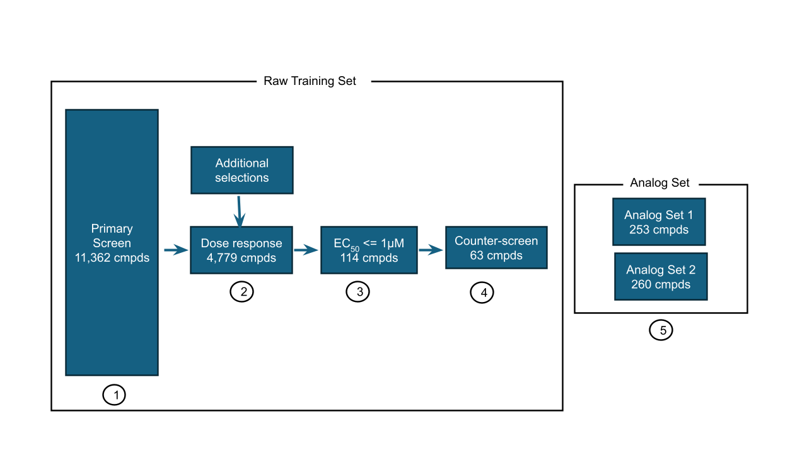

# Joining the OpenADMET PXR Blind Challenge

*March 2026*

---

The [OpenADMET group](https://openadmet.ghost.io) has announced a new blind challenge: predicting human Pregnane X Receptor (hPXR) induction. 
PXR is a nuclear receptor that, when activated, upregulates drug-metabolising enzymes — most notably CYP3A4. 
A compound that induces PXR can reduce the plasma concentration of co-administered drugs, cause adverse interactions, and derail a project that was otherwise going well. 
It is a common and expensive failure mode in drug development. 
The challenge has two tracks: one for activity prediction and one for structure prediction. 
I plan to enter only the activity prediction track.

*Crystal structure of the human Pregnane X Receptor ligand-binding domain (PDB: 1ILG). [Emw](https://commons.wikimedia.org/wiki/User:Emw), [CC BY-SA 3.0](https://creativecommons.org/licenses/by-sa/3.0/), via Wikimedia Commons.*

## Why I am doing this

Blind challenges are the closest thing to a real prospective test outside pharma and biotech companies. 
Internal cross-validation, however carefully designed, will generally be a less realistic scenario and inflate performance values. 
A blind challenge can be an extremely useful tool to compare different ML approaches in something close to a real setting.

I also want my work to be useful beyond the final ranking. 
Each step — data analysis, model selection, split strategy, prospective evaluation — will be documented openly. 
The goal is to create a worked example of how to approach a real ML problem in drug discovery. 
I hope it can be an educational resource.

## The challenge

The dataset is substantial: over 11,000 compounds screened in a single dose format and a subset of ~4800 compounds tested in a dose-response assay, with a counter-assay in a PXR-null cell line to flag false positives. 
The test set focuses on structure-activity relationships — analogue series rather than diverse screening hits — which mirrors real lead optimisation work more closely than a random held-out set.

*Dataset and assay flow for the OpenADMET PXR Induction Challenge. Image courtesy of the [OpenADMET group](https://openadmet.ghost.io).*

The task is to predict pEC50 values for 513 compounds. 
Submissions are evaluated by Relative Absolute Error (RAE). 
There are two phases: a live leaderboard on an initial analogue set (Phase 1, due May 25), followed by a fully blinded second analogue set (Phase 2, due July 1).

## What I plan to do

My work is documented in a [public repository](https://github.com/adlvdl/pxr_challenge). The short version of my expected workflow is:

1. **Data analysis and preprocessing**: download the data, explore general SAR character of the dataset, think whether any compound data is better removed or altered for training, explore public datasets that might enhance the prediction

2. **Generate data splits**: as we will be comparing ML model predictions to choose the best one, I plan to follow the process outlined in a recent paper by the Polaris group to generate 5x5 cross-validated data splits to make statistically sound comparisons. The main point to explore is whether to generate random, scaffold or time based splits

3. **Generate single task baseline**: this will likely be a comparison from different fingerprints used on RF and XGB as well as chemprop

4. **Explore multitask settings and/or finetuning models for property prediction**: previous challenges showed the impact of external data to improve predictions so this will be an important aspect. It is also possible that different data available in the challenge can be modeled separately in this manner

5. **Provide predictions for analog set 1**: this held out dataset will be unblinded in the middle of the challenge. This will provide important information for how the different models performed prospectively and might suggest alterations before submitting predictions for analog set 2

6. **Provide predictions for analog set 2**: this will be the final step and will be the set to provide the final ranking.

The implementation will use open-source libraries (RDKit, scikit-learn, XGBoost, chemprop) and the code will be organized in marimo notebooks. 
The analysis decisions are mine but I will use Claude Code as a development tool.

Updates will be posted in this blog as the work progresses.
