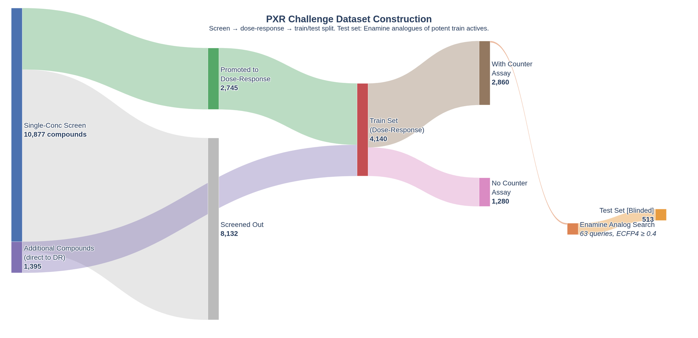
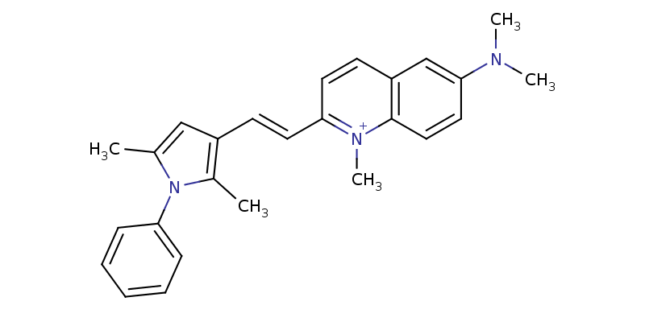

# PXR challenge #0: First contact with the data

The OpenADMET challenge started last week right in the middle of Semana Santa here in Spain. So I spent just a bit of time to make sure I had access to the datasets and providing a preliminary look at the data provided. You can look at the code at [this notebook](https://github.com/adlvdl/pxr_challenge/blob/main/marimo_notebooks/0_check_datasets.py).

## Data organization

One of the first tasks on any project is laying out your data organization principles. In an organization, you might have access to a well maintained data repository to access raw data and save processed data. If that is not the case, my general rule of thumb is:
    - keep data for a project all within a specific folder
    - separate “raw” data from “processed” data
        -- raw data are datasets downloaded or provided by partners; by keeping them separate from processed data you should be able to always go back to the original data and repeat/adjust your data preprocessing
        -- processed data should be any dataset that is based on raw data but has been modified within code in the project repository
    -  date the datasets, especially raw datasets, in case they are updated or modified outside the scope of your code repository, to be able to check and confirm changes to the previous datasets

For this challenge, I downloaded four datasets provided by OpenADMET in collaboration with Octant and the Fraser Lab. The four datasets are:
    - Single-dose dataset: 10877 compounds tested at a single or small number of concentrations
    - Dose-response dataset: the main training set, with 4140 compounds tested across a series of doses to obtain EC50 data
    - Counter-screen dataset: a subset of compounds from the dose-response dataset were tested to potentially remove false positive screening hits
    - Test set: the dataset that will be used to assess predictions

More detail about these datasets is provided in the [OpenADMET blog post](https://openadmet.ghost.io/predicting-pxr-induction-we-have-liftoff/).

## First contact

My main goal for this first notebook was to access and have a first quality control pass on the data. I wanted to confirm the number of data points in each dataset and check for duplicate structures and/or ID numbers. Chemical structures are provided as SMILES and two potential ID numbers can be seen in different datasets (Molecule Name and OCNT Batch).

You can check for duplicated chemical structures or data records in several ways. I recommend computing the InChI and InChIKey based on the SMILES provided in the data. [InChI](https://iupac.org/who-we-are/divisions/division-details/inchi/) is a string representation defined by the IUPAC that is canonical, the same chemical structure will always provide the same InChI. This cannot be guaranteed with SMILES, as different chemical toolkits can canonicalize SMILES differently, leading to different strings for the same chemical structure. An additional benefit of InChIs over SMILES is that InChIs can represent different resonant structures of the same molecule by defining a set of floating hydrogens over several heavy atoms.

This first look at the data highlighted a small number of discrepancies with the numbers reported in the blog post. Specifically, the single-dose dataset contains 10875 unique InChIKeys, two less than the number of compounds reported (10877). In addition, the blog post says 2745 compounds from the single-dose were progressed to the dose-response assay. However, I only found 2738 InChIKeys in common between the two datasets. These are small discrepancies, but worth highlighting. In an organization, I would go back to the experimentalists and make sure of the origin of the discrepancies. Often, it turned out I was provided an outdated file. Here, I asked in the Discord chat but have yet to receive a reply.

Another small thing to consider that came up in the analysis was a pair of structures (OADMET-0003733 and OADMET-0003684) with different SMILES that generated the same InChIKey. Checking the SMILES, it seems like one defines a specific cis/trans stereoisomer around a C=C bond, while the other leaves it unspecified. InChI on the other hand, assumes that double bond is part of a larger cluster of delocalized hydrogens with the adjacent ring system and doesn’t consider it a stereo center. Generally, I would recommend combining these entries by averaging their activity data, just to make sure they wouldn’t end up with one in the training set and the other in the test, which would make that instance easy to predict.

## Next steps

For the next notebook, my goal is to provide a deeper look into the data. I want to analyze the SAR content through quantitative analysis and visualization tools, and start looking at the chemical structures to have an intuition of how diverse the datasets are.