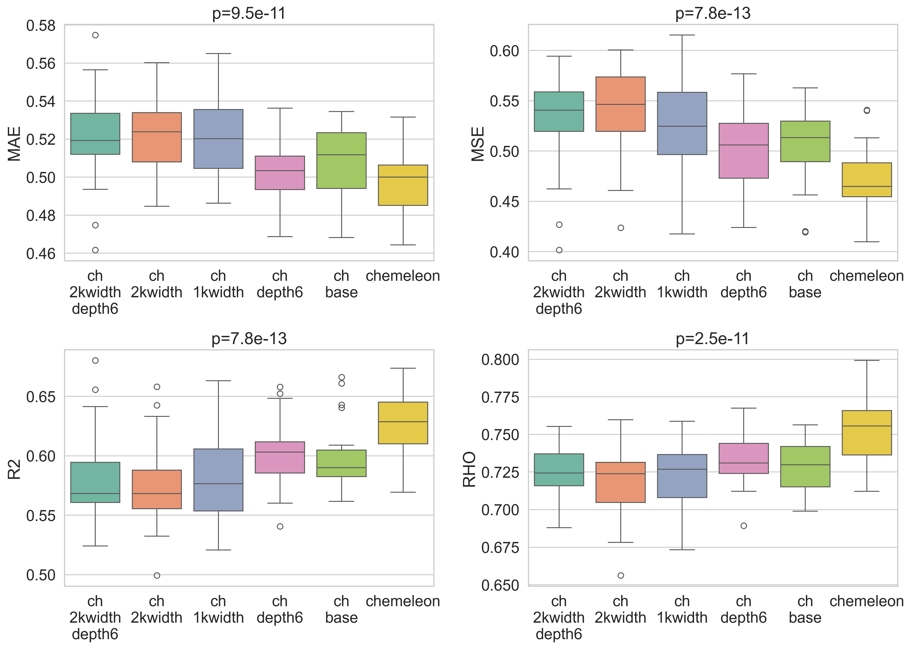
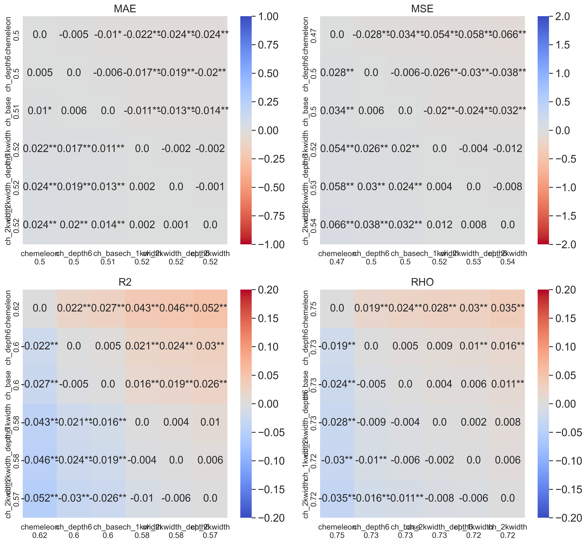
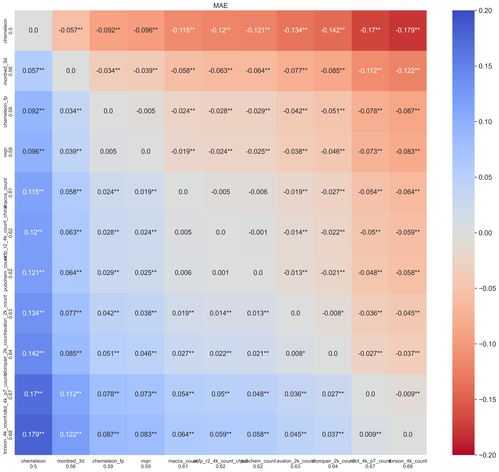
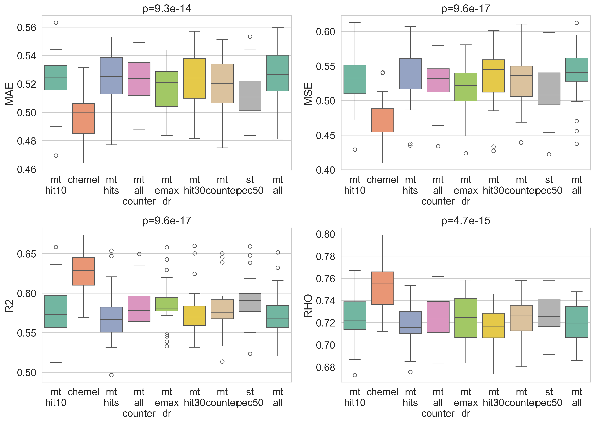

# PXR Challenge #3: Optimizing ML models

*May 2026*

---

In the [previous post](https://www.delavega.ai/posts/2026_04_22_ml_baseline.html) I trained and compared four machine learning models. 
The results showed CheMeleon as the winner, so I trained one CheMeleon model on the whole training dataset and predicted the held out test set. 
The models I trained were simple; no multitask, pretraining or hyperparameter optimization (HPO). 
In this post, I am going to try to improve the model performance over the CheMeleon model and answer some questions I am curious about:
- test whether a larger Chemprop model can bridge the gap to CheMeleon 
- explore if any fingerprint can bring tree ensemble methods closer to MPNN models 
- test different prediction ensemble and multitask scenarios to try to improve performance over single task CheMeleon.
As always, the code of the [notebook](https://github.com/adlvdl/pxr_challenge/blob/main/marimo_notebooks/3_ml_optimization.py) is available as well as an [HTML version](../html_notebooks/pxr_challenge/3_ml_optimization.html) to explore in more detail the tables and plots. 


---

## Part 1 - Chemprop vs CheMeleon

CheMeleon is a set of pretrained weights for Chemprop. 
It expands the message passing section of the network into a larger model than the default Chemprop. 
I wanted to compare if a Chemprop model, closer in size to CheMeleon but with no pretraining, would bridge the performance gap. 
In other words, how much of the performance improvement comes from pretraining and how much comes from the larger model?

The two primary differences in the message passing section are:
 - `message_hidden_dim`: in Chemprop it is 300, in CheMeleon 2048
 - `depth`: 3 in Chemprop, 6 in CheMeleon

Based on these parameters, I tested the following Chemprop configurations:
```python
_MODEL_NAMES = {
    "chemprop_base": {},
    "chemprop_depth6": {"depth": 6},
    "chemprop_1kwidth": {"message_hidden_dim": 1024},
    "chemprop_2kwidth": {"message_hidden_dim": 2048},
    "chemprop_2kwidth_depth6": {"depth": 6, "message_hidden_dim": 2048}
}
```
The results were interesting. 
While CheMeleon was statistically better than Chemprop in the previous post, the difference in MAE was small (0.5 vs 0.51). 
Most of the new models I trained here were worse than base Chemprop, except `chemprop_depth6`. 
This model was not significantly different from CheMeleon based on MAE values, but other metrics did show a difference. 
In general it seemed to land between base Chemprop and CheMeleon in most metrics.
One way to look at the results is that pretraining seems to account for half of the benefit of CheMeleon and larger depth accounts for the rest. 
The main complicating factor in this interpretation is model `chemprop_2kwidth_depth6` which is even more similar to CheMeleon than `chemprop_depth6` but didn't improve over base Chemprop.


*Metric distributions for Chemprop size variants and CheMeleon. `chemprop_depth6` is the only variant that approaches CheMeleon performance and improves performance over `chemprop_base`.*


*Pairwise MAE comparison across all model variants. Colors and numbers represent the difference in performance, stars show if the difference is significant.*

---

## Part 2 - Fingerprint comparison on Random Forest

While ECFP fingerprints are generally good fingerprints for machine learning, and often used for baseline models, the literature is clear that there is no clear fingerprint best for every dataset. 
It is always a good idea to try different alternatives. 
For this post, I used the fingerprints defined in the `scikit-fingerprints` package, as well as the CheMeleon fingerprint (the internal whole-molecule representation of the pretrained model).
For each type of fingerprint, where appropriate, I tested different configurations and parameters. 
In total, I tested around 70 different fingerprints on a default Random Forest in a 5×5 cross-validation setting. 
The results are compared to the CheMeleon model trained in the previous post.

No RF model improved over the base CheMeleon model, but several fingerprints significantly improved the MAE over the RF/ECFP4 baseline from the previous post. 
Mordred3D is the best fingerprint in this experiment.
The CheMeleon fingerprint, maybe not surprisingly, also shows very good performance. 
For me most surprising was MQN, a simple fingerprint of 42 dimensions that I had only used in the past to generate chemical space visualizations.
It was the third best fingerprint, closely tied with the CheMeleon fingerprint but worse than Mordred3D. 
Given its tiny dimension compared to most alternatives, its performance here is impressive. 


Looking in more detail within fingerprint families there are some interesting results. 
In many cases we see several fingerprints that are not significantly different from the one with the best MAE score. 
In almost all families, larger fingerprint sizes (4096 bit count) improved significantly over smaller ones (2048 or 1024 bit count).
It might have been a good idea to test even larger bit counts.
For ECFPs, the best combinations had a radius 2, beating fingerprints with radius of 3.
In addition, count-based fingerprints often beat binary ones, reducing the MAE value by about 0.02.
A final comparison I checked too late was Mordred3D vs Mordred2D, the difference is tiny and probably I could have just used the simpler representation later in the notebook.



*Cross-family fingerprint comparison: the best-performing variant from each fingerprint family versus CheMeleon. Mordred3D achieves the lowest MAE among all RF-based models, with MQN and the CheMeleon internal fingerprint as the next closest.*

---

## Part 3 - Scoring ensemble

Even when ML models have similar performance, often they make different mistakes. 
Combining predictions from different models can be a useful way to generate consensus predictions that overall reduce the rate or magnitude of mistakes. 
And if the predictions are already computed, it is computationally very cheap to test different aggregation or ensemble strategies. 

For this part I took the predictions of the four baseline models from the previous post, and generated different ensembles as a weighted mean of the four individual scores following these rules:
1. the weight for each score is either 0, 1 or 2
2. not all weights can be 2 and not all can be 0
3. combinations of 3 weights at 0 are excluded except the CheMeleon baseline (weights 0 for Chemprop, RF and GBM; 1 for CheMeleon)

This provides 72 potential combinations to explore and it's unfeasible to plot all comparisons.
This experiment is the first time I see an improvement in MAE over baseline CheMeleon. 
The best ensembles tend to disregard RF and GBM (give them weights of 0).
In the best combination, CheMeleon and Chemprop are used but predictions from CheMeleon are prioritized. 
The combinations that improved on CheMeleon were:


CheMeleon baseline MAE: **0.4983**

| Ensemble | RF | GBM | Chemprop | CheMeleon | MAE |
|---|:---:|:---:|:---:|:---:|:---:|
| ens_rf0_gbm0_cp1_ch2 | 0 | 0 | 1 | 2 | **0.4836** |
| ens_rf0_gbm0_cp1_ch1 | 0 | 0 | 1 | 1 | 0.4837 |
| ens_rf0_gbm0_cp2_ch2 | 0 | 0 | 2 | 2 | 0.4837 |
| ens_rf0_gbm0_cp2_ch1 | 0 | 0 | 2 | 1 | 0.4889 |
| ens_rf1_gbm0_cp2_ch2 | 1 | 0 | 2 | 2 | 0.4895 |
| ens_rf0_gbm1_cp2_ch2 | 0 | 1 | 2 | 2 | 0.4905 |
| ens_rf1_gbm0_cp1_ch2 | 1 | 0 | 1 | 2 | 0.4928 |
| ens_rf0_gbm1_cp1_ch2 | 0 | 1 | 1 | 2 | 0.4938 |
| ens_rf1_gbm0_cp2_ch1 | 1 | 0 | 2 | 1 | 0.4968 |
| ens_rf0_gbm1_cp2_ch1 | 0 | 1 | 2 | 1 | 0.4982 |
| CheMeleon baseline   | 0 | 0 | 0 | 1 | 0.4983 |

Weights are relative (normalized to sum = 1 at prediction)

---

## Part 4 - Multitask learning

All the models so far have been trained only on pEC50 data of the dose response screen. 
This is because that is the goal of the challenge and the main way models are assessed. 
But there is a wealth of additional data provided in the challenge. 
In this experiment, I want to see if adding some of this data to the compounds in the training set improves performance.
It is important to note that in all the models trained in this section, the number of compounds stays the same. 
Only compounds with pEC50 data in the dose response screen are included.

I tested several combinations of properties:
```python
_SCENARIOS: list[tuple[str, list[str]]] = [
        ("st_pec50",      ["pEC50_dr"]),
        ("mt_emax_dr",    ["pEC50_dr", "Emax_dr"]),
        ("mt_counter",    ["pEC50_dr", "pEC50_counter", "Emax_counter"]),
        ("mt_hit10",      ["pEC50_dr", "10.0_is_hit"]),
        ("mt_hit30",      ["pEC50_dr", "30.0_is_hit"]),
        ("mt_hits",       ["pEC50_dr", "10.0_is_hit", "30.0_is_hit"]),
        ("mt_all_counter",["pEC50_dr", "pEC50_counter", "Emax_dr", "Emax_counter"]),
        ("mt_all",        ["pEC50_dr", "pEC50_counter", "Emax_dr", "Emax_counter",
                           "10.0_is_hit", "30.0_is_hit"]),
    ]
```
As a control I include the single task test. 
Missing data for any assay is left blank, and it is ignored in computing the loss during training. 
I trained Chemprop models rather than CheMeleon ones due to speed considerations and I expect results can be extrapolated to CheMeleon. 

It was discouraging to see that none of the models improved on the CheMeleon baseline.
Worse, the model with the best MAE was `st_pec50`, the single task control model. 
It could be something wrong with how I set up Chemprop for multitask learning. 
It might be that I need to use the parameter `task-weights` to emphasize the prediction of `pEC50_dr` and reduce it for other tasks. 
Overall this is something I will need to give more consideration in future notebooks if I want to dig deeper. 


*Metric distributions for all multitask scenarios. The single-task control `st_pec50` is competitive with or better than all multitask variants.*


---

## Part 5 - Hyperparameter Optimization

The process of hyperparameter optimization (HPO) is very typical in a ML workflow. 
Some models, like RandomForest, tend to be very robust, and HPO doesn't tend to change performance much from a baseline. 
In other models, like deep neural networks, it can have a big impact. 

There are many ways to guide a HPO process. 
You normally first set a series of hyperparameters and a set or range of values. 
This defines the search space. 
You can try to thoroughly test all possible combinations of hyperparameter values, but that tends to be unfeasible. 
You can just set a budget of models to train and get a set of random combinations. 
Here, I wanted to use Optuna to guide the process so it is not a random selection.
Optuna is a widely used library to guide the HPO process. 
The first few runs might use a random combination of values, but over time Optuna optimizes based on the performance of the model towards favorable combinations of hyperparameter values.

My idea was to perform HPO on Chemprop as it generally is a smaller model that trains faster. 
I would not repeat the parameters I already tested in Part 1, as those will be set differently by CheMeleon. 
However, either I configured the run wrong or simply underestimated the amount of time it would take.
When I started the code it reported it would take around 30 hours. 
72 hours in, it was not yet done and it reported it would still take several more days. 
Each Chemprop trial seemed to take exponentially longer and the best MAE reported was still around 0.50. 
I decided to stop it and push back this effort until a later point. 
I moved the code into a different notebook for the future.

---

## Final part - Generating new test set predictions

Over the course of this post, I tested four different strategies to improve performance of the four models I have defined so far. 
While only prediction ensemble beat the CheMeleon baseline from the previous post, I did get meaningful improvements on Chemprop and RF models.
So I chose to focus on ensembling predictions for the test set. 
As we are still in Phase 1 of the competition, we are allowed to upload predictions several times a day and see the performance in the analog set 1.

I generated four different submission files using ensembles of three different models trained on the whole training dataset:
1. Baseline CheMeleon (the predictions I generated in the last post)
2. Chemprop with a depth value of 6
3. Random Forest trained on Mordred3D descriptors

The four different submissions came from different weights to these three models, choosing from those combinations that beat the CheMeleon baseline. 
The naming scheme is 'rfX_cpY_chZ', where X, Y and Z are the weights for RF, Chemprop, and CheMeleon, respectively.
Below I show the performance and compare it to the previous submission:

| Set | MAE | R² | ρ | Ranking |
|---|---|---|---|---|
| CheMeleon only | 0.574 | 0.336 | 0.708 | 109 of 155 | 
| rf0_cp1_ch2    | 0.521 | 0.430 | 0.750 | 65 of 156  |
| rf1_cp1_ch2    | 0.515 | 0.454 | 0.754 | 61 of 156  |
| rf1_cp2_ch2    | 0.507 | 0.473 |       | 51 of 156  |
| rf0_cp1_ch1    | 0.503 | 0.463 | 0.770 | 50 of 159  |

My previous submission had over time slid back in the ranking from 57 of 84 to 109 of 155.
Those numbers show many new contestants have joined the competition since I last submitted.
I list the ensembles in order of upload, and it was coincidence that they all kept improving the performance. 
I expected rf1_cp1_ch2 to be the best combination, but I was wrong.
While ensembling predictions in the 5×5 CV test led to modest improvements (from 0.50 to 0.48), in the test set we see a big boost in performance from 0.57 to 0.50. 
The gap between MAE values in the 5×5 CV and test set reduced a lot compared to the previous post.

## Next steps

There are several possible things to try next and I am still a bit undecided on what to prioritize as I also have less free time at the moment. 
It is likely the next post will take some additional time to come out. 
Some of the options are:
- keep trying multitask learning and HPO
- pretrain Chemprop/CheMeleon models on single dose or counter data (this is something I saw another contestant, [JacksonBurns](https://github.com/JacksonBurns/openadmet_pxr) do in a previous submission)
- test additional models to include and improve the ensemble like TabPFN (which I heard about in the Discord chat) or Macau (this would be another multitask attempt)
- look for potential open data that could improve multitask or pretraining scenarios
