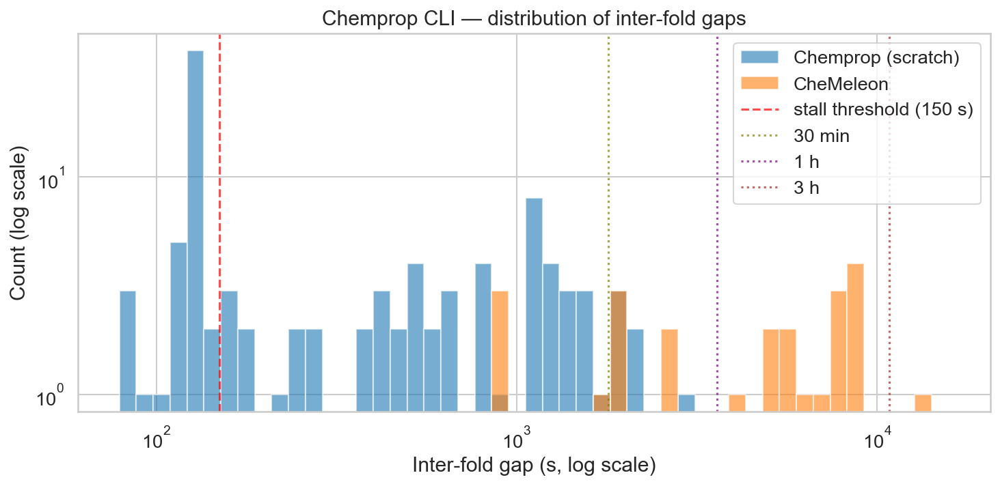
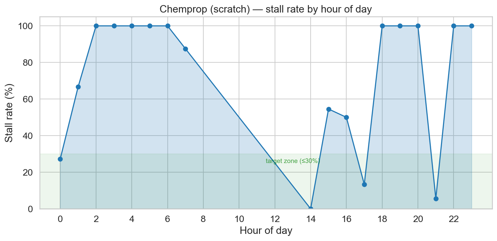
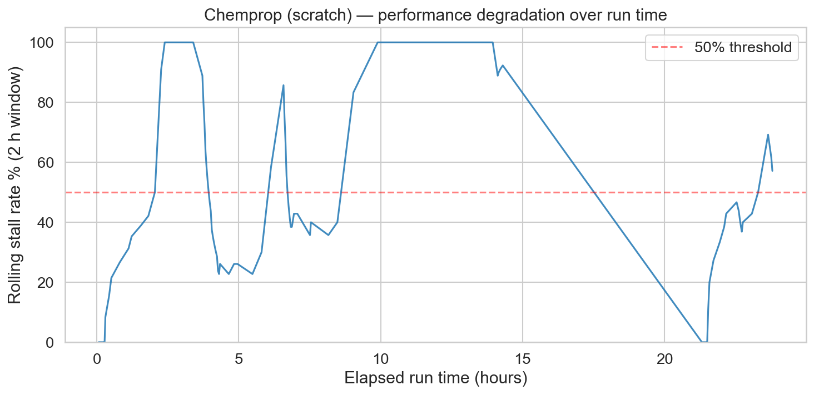
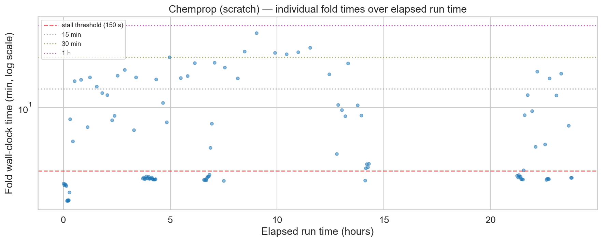

# Stalling the M4 engine

*May 2026*
Tag: Hardware

---

I am still working on my next post for the PXR challenge as I hope to upload a few more predictions before the end of the first phase on May 25. 
However, progress has been slow due to a set of issues related to the machine I use for this challenge, a base M4 Mac Mini.
When I bought the machine I thought it was great hardware for the price. 
For around 700 euros, I got a decent day to day machine with a GPU that had access to 16GB of RAM.
That was very attractive for light machine learning work. 
I knew I was not going to be training huge transformer models on this machine, but alternatives like the Strix Halo platform or a PC with a gaming or workstation GPU were generally more expensive.
And all was fine until, as mentioned in [my last post](../posts/2026_05_01_ml_optimization.html), I tried to perform hyperparameter optimization (HPO) on chemprop models.

## It just keeps taking longer

Chemprop is generally a small model that, on the standard 5x5 CV data splits I have been using, trains a model and predicts on the test set in about 2 minutes on my machine. 
So a full set of 5x5CV folds generally takes less than an hour.
For the power that this model has shown, it is very light and efficient. 
CheMeleon makes the Chemprop model larger, taking comparatively much longer time for the increase in performance it provides. 

I set up the HPO using Optuna, making each experiment run a 1x5CV so performance would be measured on the whole data set. 
I initially set it to do 30 experiments. 
30 experiments * 5 folds per experiment = 150 models trained. 
At 2 minutes per model, it seemed a reasonable amount of training.
It should have been done overnight easily.

The next morning, it had completed ten experiments and reported it would take a full day to finish.
My thought was that some of the hyperparameters I was using were pushing model training time longer.
I was not concerned. 
However, after 24 hours of training it was not yet done. 
It had completed 20 experiments but said the last 10 would take two more days. 
At that point I stopped the process, scrapped the code from [notebook #3](https://github.com/adlvdl/pxr_challenge/blob/main/marimo_notebooks/3_ml_optimization.py) and completed the [third post](../posts/2026_05_01_ml_optimization.html) without it.
One mistake I made was not to set up the Optuna process so each experiment was saved as it was completed. 
So a repeat would start from scratch.
In my defense, I didn't think it was worth it if the HPO would finish in 5 hours. 

## My Mac is not a night person

When working on notebook #4, I wanted to tackle the HPO process again. 
I set it up better: I kept track of each experiment as it finished and I first tested the training time of a model for the hyperparameters I was modifying. 
I started thinking something was up after checking the timings of the different hyperparameters.
None of them had a large effect on how long the model took to train to explain the increase in run time of the previous HPO process.
And the new, ongoing HPO seemed to be showing similar signs of experiments taking longer over time.
And so, I started looking at the logs.

Before getting into the log data, I wanted to briefly detail how I apply Chemprop on the notebooks. 
You can run Chemprop on a command line interface program (CLI) or using a series of Python imports and functions based on PyTorch (API).
My first version of running Chemprop used the Python API.
But it encountered issues in the notebook, where torch was crashing due to a conflict with another library the notebook was using.
Sadly I don't recall the whole issue, I think it was related to OpenMP. 
I do remember Claude trying to set a few environment variables in the notebook to stop the issue but that solution didn't work. 
So the code uses the CLI program, using subprocess to call the train and predict commands.

The first thing I checked in the logs was how long it took models to train. 
The runtime varied a lot.
There was a large set of models that trained within 2 minutes, but also some that took an order of magnitude more. 
In worst cases, training took almost an hour.
Looking specifically at the runs from notebook #4's HPO, a pattern began to emerge.

*Distribution of Chemprop training duration. The long tail (gaps of tens of minutes to an hour) is the stalling behavior that was inflating total HPO runtime.*

The plot below shows stall rate by time of day, where a stall is defined as a model that took more than 2.5 minutes to train. 
At first glance, it pointed to macOS running aggressive background processes during the night.
Worth noting: Activity Monitor never showed concerning memory pressure throughout (the graph stayed in the green), so the OS didn't seem overwhelmed.

*Stall rate by hour of day. The concentration during night hours initially pointed toward macOS background activity as the culprit.*

The previous plot turned out to be slightly misleading.
Plotting the stall rate as a function of time elapsed since starting the HPO told a clearer story: after a few hours, stalls were essentially guaranteed.

*Stall rate versus time elapsed since the HPO process started. Stalls become near-universal after a few hours regardless of time of day, pointing to progressive GPU memory exhaustion rather than a scheduling issue.* 

*Training time per fold across HPO experiments. Individual fold runtimes are broadly consistent, but a growing number of outliers marks the onset of stalling.*

After a bit more troubleshooting, Claude suggested the stalls were due to poor memory management of the GPU in the M4 chip. 
Supposedly, after the Chemprop train subprocess finished, the memory should be released. 
But that didn't seem to be the case.

I tested running an API version of the model within a subprocess, explicitly calling `torch.mps.synchronize()` and `torch.mps.empty_cache()`.
This should release the memory from the GPU before finishing the script. 
While this seemed to work a bit better, it didn't remove the stalls. 
On top of that, the API version produced a MAE 0.05 higher than the CLI version, meaning the two are not equivalent — an unexpected and unwelcome difference.
The main solution seemed to be to restart the computer every once in a while.
Bonus mistake: the log files for chemprop training were in a temporary folder and restarting deleted most of them, so I lost some of the logs and the images I show on this post are from a fraction of the trained models.

# Why won't it fit?

The second issue I found came up when I tried TabPFN. 
This is a new model for me, I heard about it in the challenge Discord. 
It runs some form of neural network on tabular data. 
I wanted to compare it to RF on the same fingerprints that seemed to work best. 
However, the model would crash, saying it couldn't allocate enough memory. 
The frustrating part was that the amount of memory it wanted to allocate should have fit within my RAM, but apparently the GPU can't access all of it.
Supposedly you can use `PYTORCH_MPS_HIGH_WATERMARK_RATIO` to manage how much memory you can allocate, but it didn't seem to make a difference in my case.

These issues could be implementation errors on my part, and I would love to hear if there are ways to improve how I use MPS to run ML models in my Mac Mini. 
I sometimes regret not spending more and getting a more powerful machine.
However, I bought the machine shortly after being laid off last year.
At the time, I only had a crappy Windows laptop (which I am using to write this post from the nice library we have by the river in Seville).
Considering I was planning to take some time off and live off unemployment and severance money, I cut myself plenty of slack on the decision to buy this machine and not something more expensive. 
And I am generally pretty happy with the machine, but these last few weeks have shown me some limitations that I was not expecting. 
