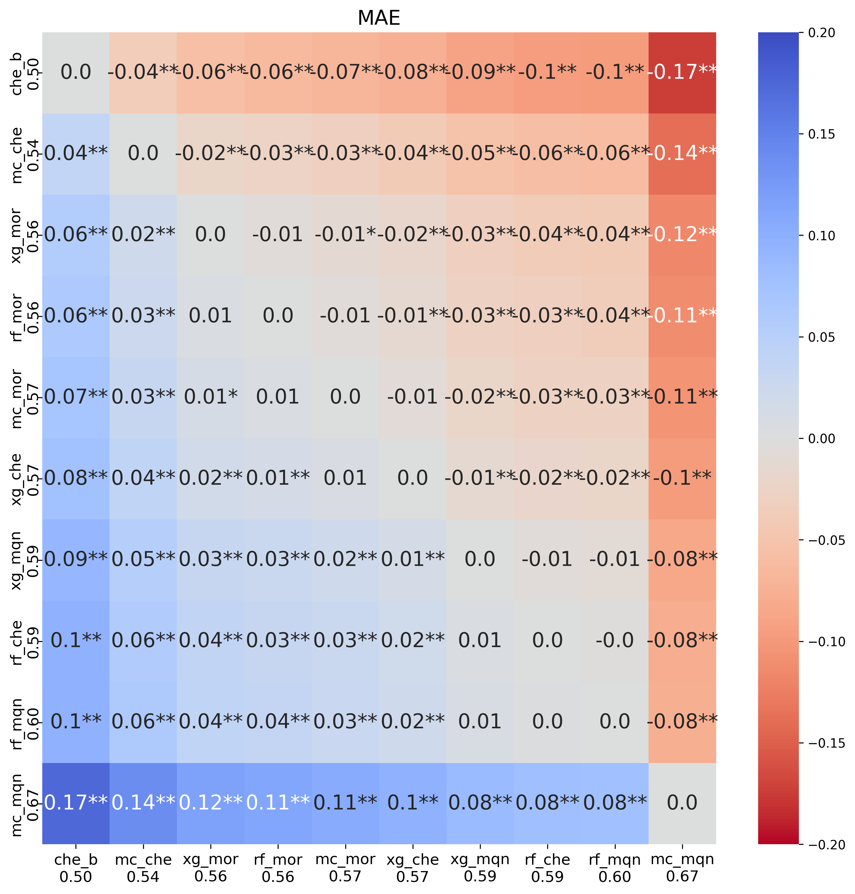
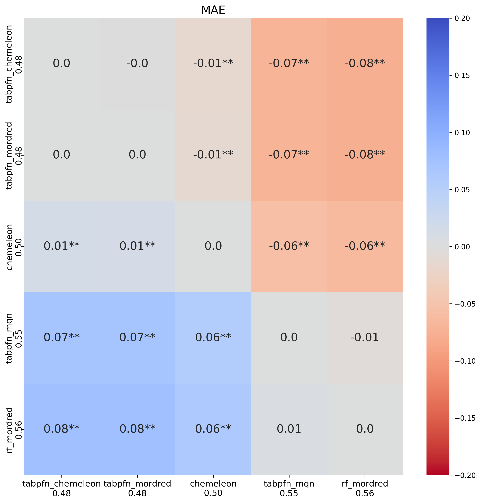
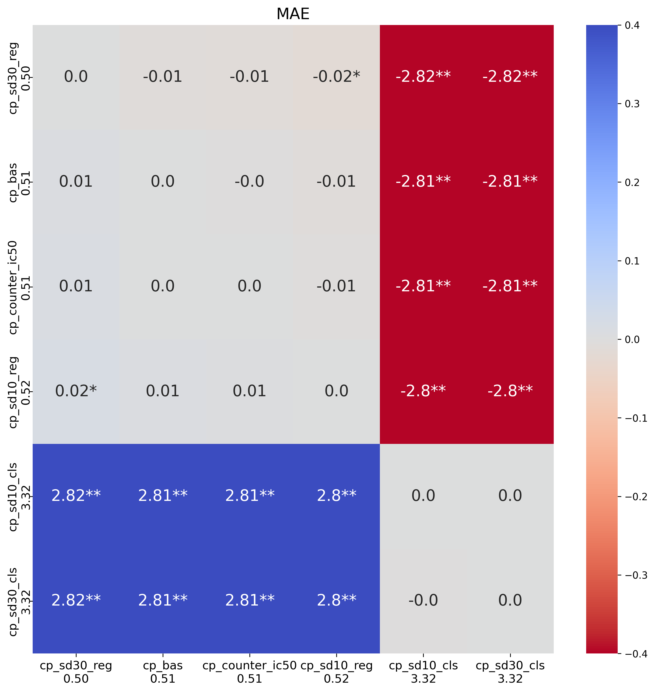
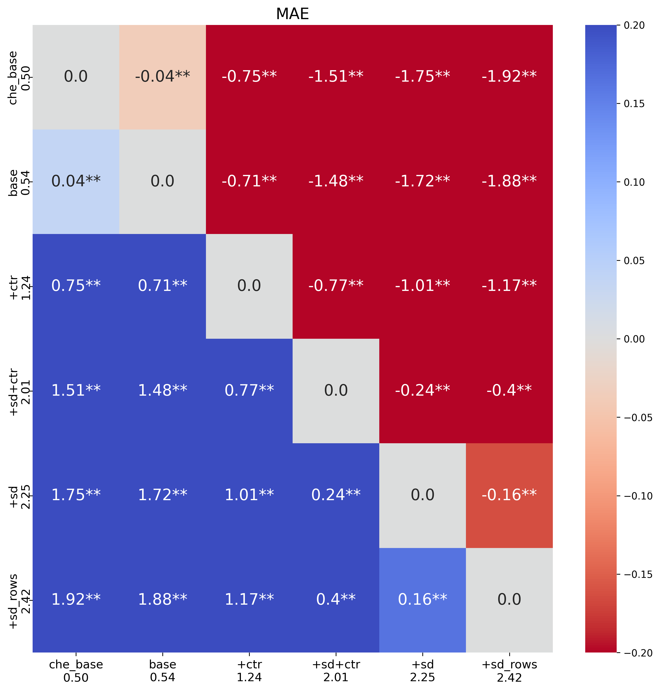
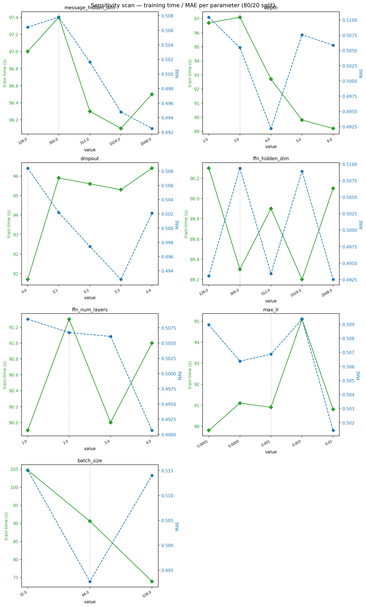
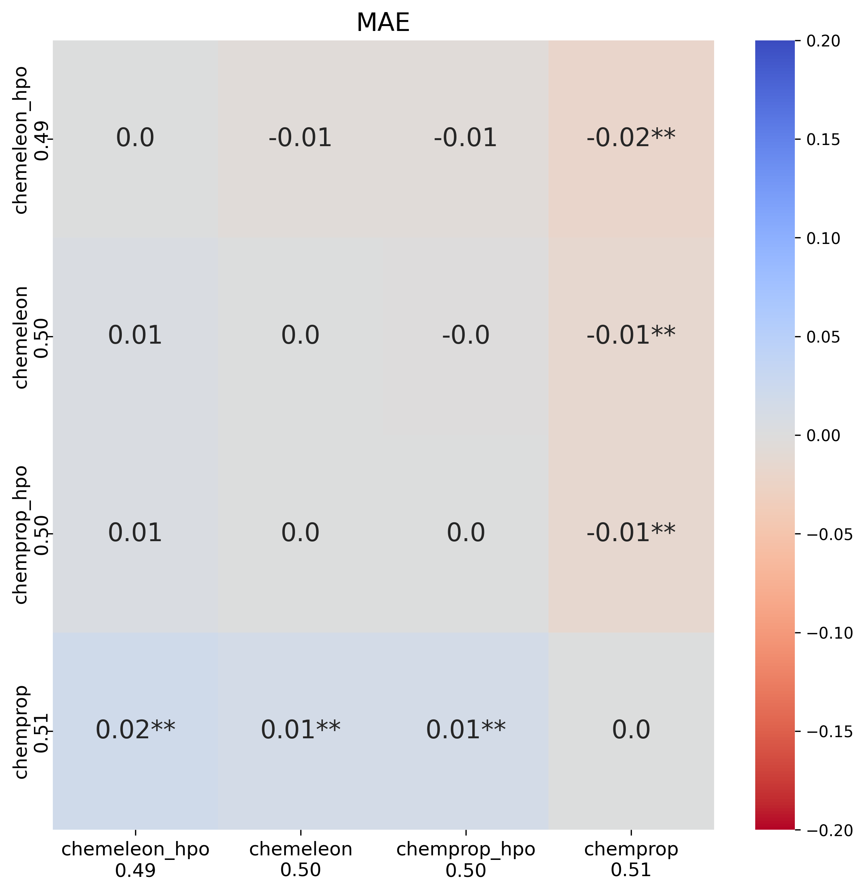
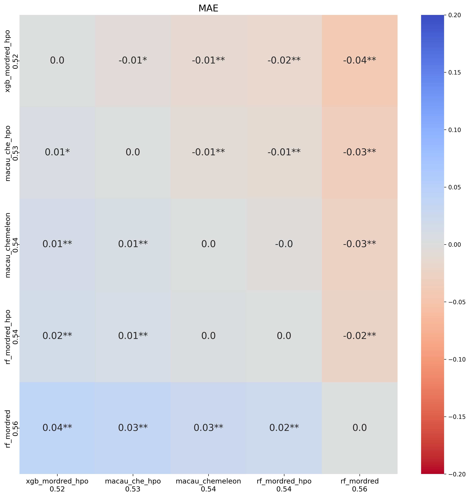
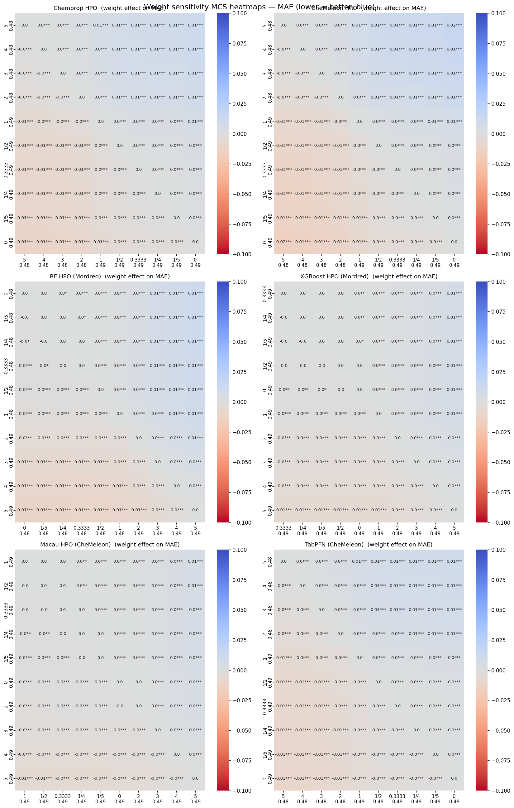

# PXR Challenge #4: Almost at the end of phase 1

*May 2026*
Tag: blind challenge

---

Next week, phase 1 of the PXR challenge will close, and the organizers will release part of the blinded test set.
I think at that point, we will be able to submit and be assessed on the second part of the test set, but we won't be able to see how we are doing in the leaderboard.
Before the end of phase 1 I wanted to perform a bit more optimization on the models and ensembles I was generating, including testing a few new model architectures.
If you have been following along, you may have also read [my recent post](2026_05_15_mps_issues.html) about the MPS memory issues on my M4 Mac Mini that slowed progress considerably. 

In this post I will show the results of:
- testing Macau and TabPFN, new models based on fingerprints
- performing hyperparameter optimization (HPO) for most of the models
- testing multitarget prediction on Macau and pretraining models on Chemprop
- expanding the ensembling approach that worked so well in the last notebook

As always, the code of the [notebook](https://github.com/adlvdl/pxr_challenge/blob/main/marimo_notebooks/4_ml_optimization_2.py) is available as well as an [HTML version](../html_notebooks/pxr_challenge/4_ml_optimization_2.html) to explore the tables and plots in more detail.

---

## Part 1 — Macau and TabPFN

Macau is a Bayesian matrix factorization method implemented in the `smurff` package. 
It uses the fingerprint matrix as side information during factorization, which allows it to model compound-property relationships in a way that is fundamentally different from tree ensembles. 
I had previous experience with Macau during my postdoc (see [paper](https://dx.doi.org/10.1186/s13321-018-0281-z)). 
It performed similarly to DNN in that paper and not many people know about this type of approach.
In a multi-target setting it can even have an assay side information matrix, although I have never tested that.

I first compared Macau to Random Forest (RF) and XGBoost on the three top fingerprints from the last analysis: Mordred 2D descriptors, MQN counts, and the CheMeleon learned embedding.
The nine combinations (three models × three fingerprints) were evaluated using 5×5 nested CV with the same protocol as previous notebooks.

*Tukey HSD pairwise MAE comparison for the Macau comparison.*

First point is that none of the models improved upon the CheMeleon baseline. 
Macau with CheMeleon fingerprints improved upon RF and XGBoost using Mordred descriptors.
A curiosity is that with MQN fingerprints, Macau performed much worse than RF or XGBoost on that fingerprint.
At first glance, Macau based on CheMeleon fingerprints seems like a good addition to our ensemble model (more on that later in this post).

TabPFN is another new method for this analysis, and a new method for me.
TabPFN (Tabular Prior-data Fitted Networks) is a transformer trained offline on a large number of synthetically generated tabular datasets sampled from a prior distribution over datasets. 
At inference time, the entire training set is passed as context to the transformer. 
I have seen this method discussed in the PXR challenge Discord and wanted to give it a spin.
Similar to Macau, I tested the three fingerprints that worked best for RF. 

*Tukey HSD pairwise MAE comparison for the TabPFN comparison.*

My first surprise was that we finally have a baseline model that improves upon CheMeleon.
Both CheMeleon fingerprints and Mordred-based TabPFN outperformed CheMeleon.
The model based on MQN performed poorly, in comparison, but not as bad as Macau+MQN did.
Again, this seems a useful model to include in the ensemble.

---

## Part 2 — Chemprop pretraining

For this test, I first train a Chemprop model on some of the additional data like the single dose screen, before training a standard model.
The idea is that the pretraining will improve the initial weighting of the model and lead to a better model.
I tested the following settings:

| Name | Columns used | Task | Compounds | Notes |
|---|---|---|---|---|
| `sd10_reg` | `10.0_log2_fc` | regression | ~10 747 | 10 µM single-dose; includes DR-overlap compounds |
| `sd30_reg` | `30.0_log2_fc` | regression | ~9 523 | 30 µM single-dose; includes DR-overlap compounds |
| `sd10_cls` | `10.0_is_hit` | classification | ~10 747 | Same as sd10_reg but predicting hit/non-hit |
| `sd30_cls` | `30.0_is_hit` | classification | ~9 523 | Same as sd30_reg but predicting hit/non-hit |
| `counter_ic50` | `pEC50_counter` | regression | 2 646 | All counter compounds are also in DR — mild label-leakage risk |

In both cases, the model will see compounds that will be in the test set, potentially leading to a case of information leakage.
However, that concern was mostly unfounded when I saw the results.

*Tukey HSD pairwise MAE comparison for comparison of pretrained Chemprop models.*

While one setting, `sd30_reg`, led to smaller MAE values, the differences from the base Chemprop model were not significant.
Most other models performed worse, especially those that pretrained a classification model.
This is likely an implementation mistake on my part, because those results look very bad. 
Overall, it didn't seem the increased complexity was worth it. 

---

## Part 3 — Macau for multitask learning

In the [previous notebook](2026_05_01_ml_optimization.html), multitask learning on Chemprop didn't improve the prediction of the dose response data. 
However, I thought it was worth a second look with Macau.
Matrix factorization methods handle missing data natively (missing target values are simply not used in the factorization loss), which makes them well suited for sparse multitask scenarios like this one.
I tested four scenarios, all using the same 5×5 CV splits as in other analyses:

| Scenario | Train rows | Targets | Description |
|----------|-----------|---------|-------------|
| `base` | 4 138 | pEC50\_dr | DR compounds only — from Analysis 1 (`macau_chemeleon`) |
| `+sd_cols` | 4 138 | pEC50\_dr + 10 µM log₂FC | Adds single-dose signal for ~66 % of DR compounds |
| `+counter` | 4 138 | pEC50\_dr + pEC50\_counter | Adds counter-assay IC50 for ~64 % of DR compounds |
| `+sd_counter` | 4 138 | pEC50\_dr + 10 µM log₂FC + pEC50\_counter | Both auxiliary columns, DR compounds only |
| `+sd_rows` | 12 269 | pEC50\_dr + 10 µM log₂FC | Augments training matrix with 8 131 SD-only compounds (pEC50\_dr = missing) |

For all settings except `+sd_rows` I only add columns to the training set (either single dose or counter screen data for training compounds).
In `+sd_rows`, I added additional compounds from the single dose dataset that were not progressed to dose response.

*Tukey HSD pairwise MAE comparison across Macau multitask configurations. Results are compared to the single-task Macau and the CheMeleon baseline.*

This is another test that fails to show an improvement. 
All models perform extremely poorly, and are not worth considering going forward.

---

## Part 4 — Hyperparameter optimization

I have already written about [the issues]((2026_05_15_mps_issues.html)) I encountered running HPO for Chemprop.
Given the HPO failures in [notebook #3](2026_05_01_ml_optimization.html), I attempted a more targeted approach here. 
Rather than a broad Optuna search over many hyperparameters, I first ran a sensitivity scan to identify which hyperparameters actually affect performance.
This would let me know if any parameter increased the run time substantially.

*Sensitivity of MAE to individual hyperparameter values. Parameters with flat sensitivity profiles can be safely excluded from the HPO search space.*

None of the parameters, other than batch_size, have a large influence on run time.
I set up the HPO to perform 50 experiments, and that took a long time to run, including a few machine restarts to hopefully clear memory issues with MPS.
And it was mostly for very little gain.

*Tukey HSD pairwise MAE comparison for HPO configurations versus the CheMeleon baseline.*

The MAE heatmap shows that the HPO increased the performance of Chemprop to the level of CheMeleon, a reduction of around 0.01 MAE.
When I translated the best parameter set to CheMeleon, we saw an increase in MAE but it was not significantly different from base CheMeleon.
Considering how much slower CheMeleon runs compared to Chemprop I decided not to do a HPO for CheMeleon.

I also ran HPO for Macau, RF and XGBoost on their best fingerprint.
In this case, I first ran 20 trials for each method.
After the trials were done, I checked if any of the hyperparameters were consistently chosen at close to the maximum or minimum value.
This happened for `n_estimators` in XGBoost, which I increased from a maximum of 800 to a maximum of 1500.
It also happened for `nsamples` and `burnin` in Macau, both of which were also increased.
Then I ran an additional 30 trials.

*Alternative view of the HPO results grouped by configuration type.*

The improvements here were more significant, especially for XGBoost which jumped from 0.56 to 0.52 MAE.
Macau also showed an improvement but was more moderate.

---

## Part 5 — Ensemble

As a final analysis I ran an ensemble test similar to the one in the previous notebook.
In this case six models were potentially included as part of the ensemble:
1. CheMeleon baseline
2. Chemprop with HPO parameters
3. Random Forest with Mordred2D descriptors and HPO parameters
4. XGBoost with Mordred2D descriptors and HPO parameters
5. Macau with CheMeleon fingerprint and HPO parameters
6. TabPFN with CheMeleon fingerprint and base parameters

In addition to the increased number of models, I tested a larger number of potential weight values: `{0, ⅕, ¼, ⅓, ½, 1, 2, 3, 4, 5}`.
As before I tested all potential combinations of weight values for the six models, except where all weight values were zero except one.
This meant testing almost 1 million combinations.

*Tukey HSD pairwise MAE comparison across ensemble configurations. For each model, different weight values are compared.*

The best ensemble reduced MAE to 0.47, the lowest yet.
The plot shows the effect of the weight for each individual model.
The top row with Chemprop and CheMeleon shows high weight values were generally better.
For Random Forest and XGBoost best values were for weights close to zero.
Macau's best weight was 1, and TabPFN also had high weight values like Chemprop and CheMeleon.

---

## Final part - Generating new test set predictions

These will be my last submissions before the end of Phase 1. 
I submitted a combination of some ensemble models with weights guided by the plot above and single model predictions for Macau and TabPFN.
The ensembles I submitted were:

| File | Weights (cp · ch · rf · xg · mc · tf) |
|------|---------------------------------------|
| `4_ens_cp4_ch5_rf0_xg1_mc0_tf5_submission.csv` | 4 · 5 · 0 · 1 · 0 · 5 |
| `4_ens_cp4_ch5_rf0_xg1_mc1_tf5_submission.csv` | 4 · 5 · 0 · 1 · 1 · 5 |
| `4_ens_cp5_ch5_rf0_xg13_mc1_tf5_submission.csv` | 5 · 5 · 0 · ⅓ · 1 · 5 |

Below I show the performance and compare it to the previous submissions from [notebook #3](2026_05_01_ml_optimization.html):

| Set | MAE | R² | ρ | Ranking |
|---|---|---|---|---|
| CheMeleon only | 0.574 | 0.336 | 0.708 | 109 of 155 | 
| rf0_cp1_ch2    | 0.521 | 0.430 | 0.750 | 65 of 156  |
| rf1_cp1_ch2    | 0.515 | 0.454 | 0.754 | 61 of 156  |
| rf1_cp2_ch2    | 0.507 | 0.473 |       | 51 of 156  |
| rf0_cp1_ch1    | 0.503 | 0.463 | 0.770 | 50 of 159 (now 77 of 241)  |
| TabPFN         | 0.528 | 0.474 | 0.730 | 118 of 242 |
| Macau          | 0.533 | 0.488 | 0.736 | 124 of 243 |
| cp4_ch5_rf0_xg1_mc1_tf5 | 0.497 | 0.491 | 0.779 | 74 of 245 |
| cp4_ch5_rf0_xg1_mc0_tf5 | 0.498 | 0.487 | 0.778 | 78 of 248 |
| cp5_ch5_rf0_xg13_mc1_tf5 | 0.495 | 0.491 | 0.780 | 78 of 252 |

Overall, I am still (at the time of submission) within the top third of the ranking, which I am happy with. 
It was interesting to see that both Macau and TabPFN improved over the baseline CheMeleon, but were still worse than all ensembles.

---

## Next steps

After the organizers release the first set of blind data, the next one or two notebooks will focus on the analysis of predictions.
I want to understand where each model was making mistakes and if there were consistent mistakes that point towards improvements I can make when treating the data.
One example I want to focus on in detail is whether test compounds that were most similar to a train compound that is involved in activity cliffs in the training set were predicted worse than average.
If you reached here, thank you for reading to the end. 
If you have suggestions you want me to look at, feel free to leave a comment below.
