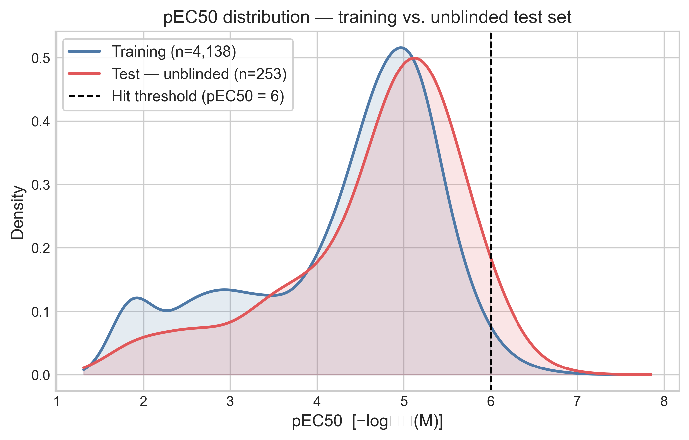
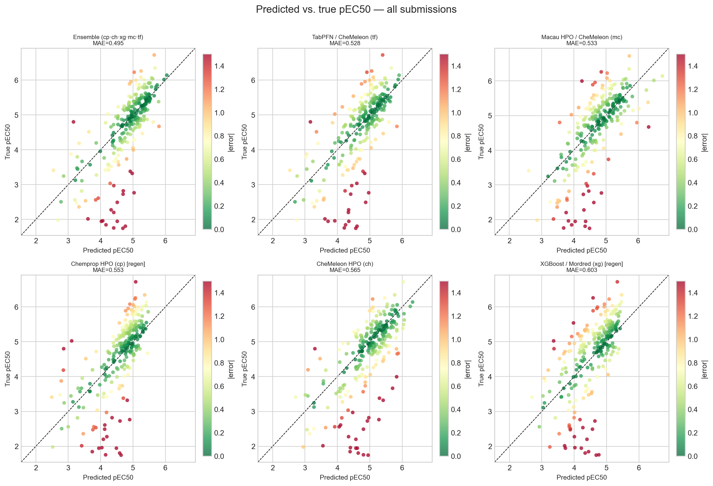
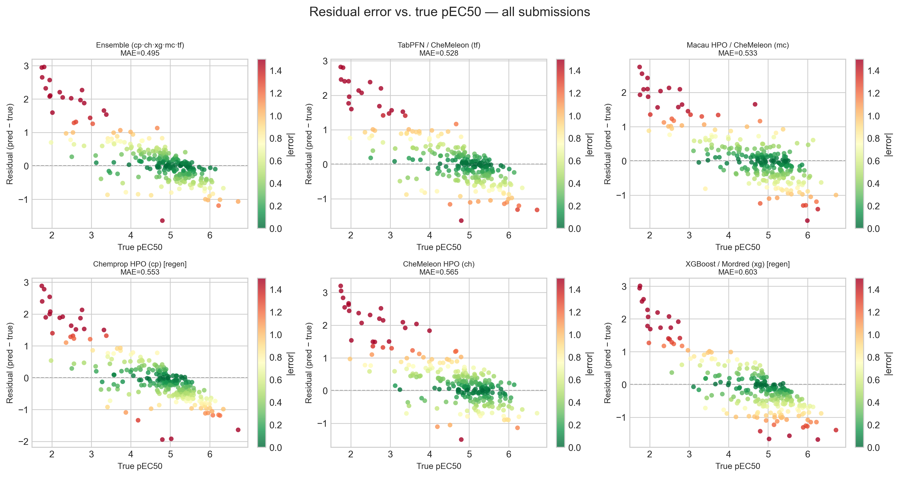
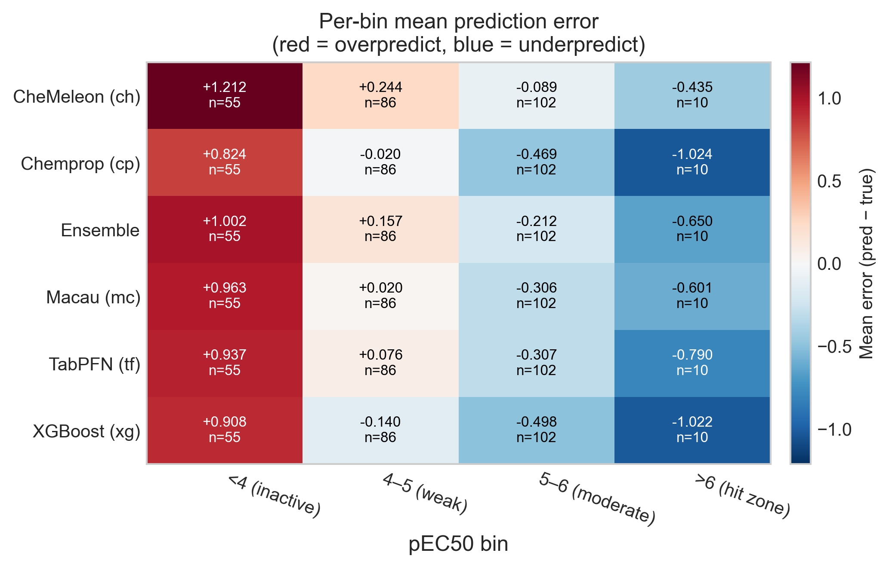
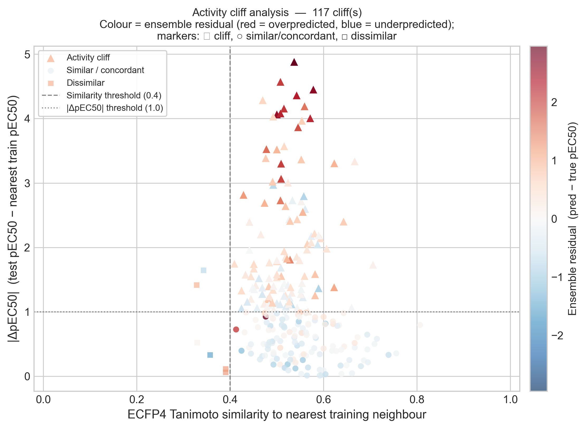
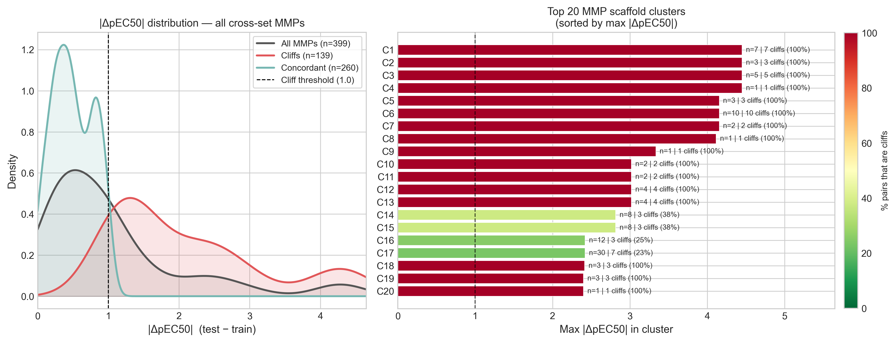
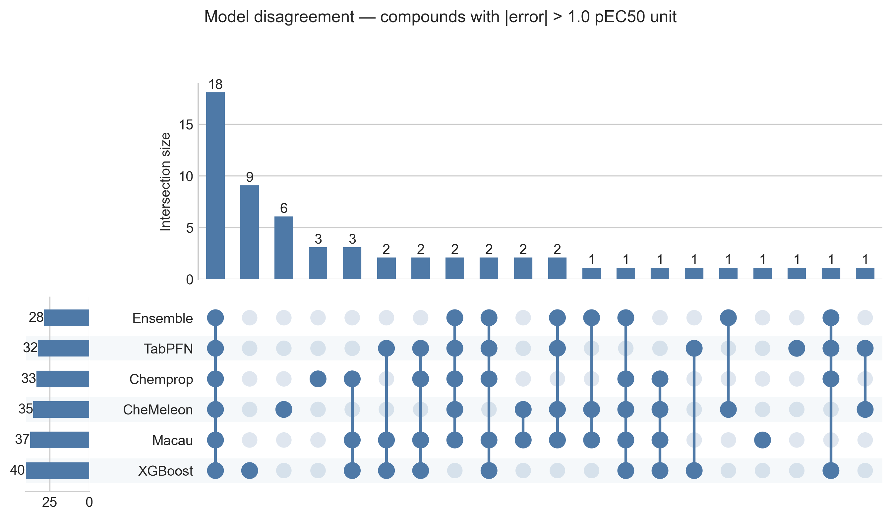
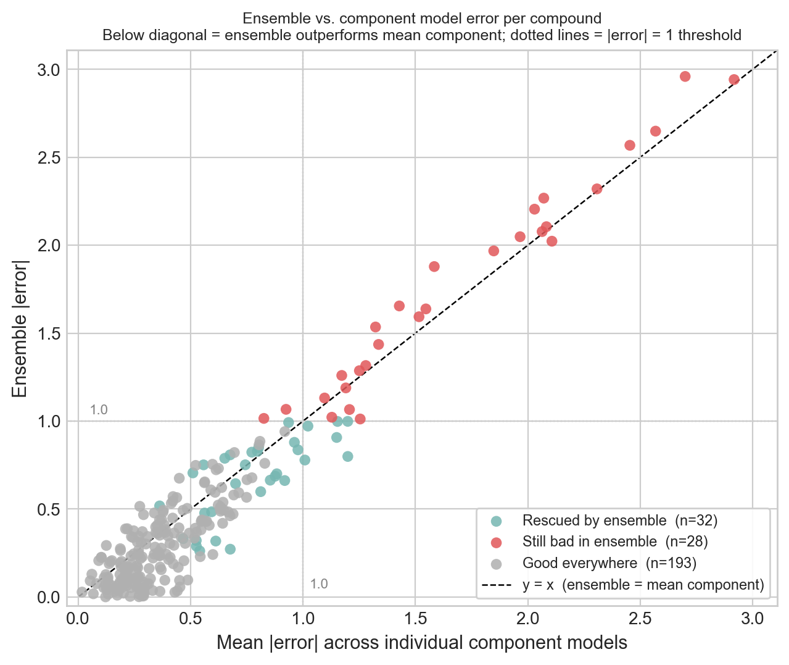

# PXR Challenge #5: Unblinding the Phase 1 test set

*June 2026*
Tag: blind challenge

---

Phase 1 of the PXR challenge has closed, and the organizers have released the ground-truth labels for the analog set 1 test compounds.
For the first time I can stop staring at a single leaderboard number and actually focus in more detail: where did the models do well and where did they fail?

At the end of [the previous post](2026_05_21_ml_optimization_2.html) I promised one specific question — whether test compounds that sit close to training-set activity cliffs are predicted worse than average.
The short answer is yes, and this notebook quantifies it, along with a few things I did not expect.

In this post I will cover:
- how the unblinded test set compares to the training data, and how few genuine hits it actually contains
- a final, honest ranking of the six prediction sources now that the labels are known
- a systematic bias that *every* model shares
- activity cliffs, by nearest-neighbor and by matched molecular pair, and a direct test of the cliff hypothesis
- which compounds break every model at once, and whether the ensemble can rescue them

As always, the [notebook](https://github.com/adlvdl/pxr_challenge/blob/main/marimo_notebooks/5_unblinded_analysis.py) is available, as well as an [HTML version](../html_notebooks/pxr_challenge/5_unblinded_analysis.html) to explore the tables and interactive plots in more detail.

---

## Part 1 — What the unblinded test set looks like

The released file contains 253 compounds with full dose-response parameters: pEC50, Emax, and confidence intervals.
Considering these compounds were selected as analogs of highly active compounds in the training set, the first question to look at is: how much has the activity distribution shifted?
A quick way to check is to overlay the two pEC50 distributions with a kernel density estimate.

*pEC50 distribution for the training set (n ≈ 4,100) and the unblinded test set (n = 253). The two overlap closely, while good for ML it is surprising the distribution was not shifted further.*

The good news for ML models is that the distributions sit almost on top of each other, so the distributions of the training and test set are similar.
However, this is unexpected. 
I would have expected a larger shift to higher pEC50 values.
The test set is dominated by weak-to-moderate compounds: the median pEC50 is 4.9, about 78% of compounds sit above pEC50 4, but only **10 of the 253 compounds (4%)** clear the pEC50 ≥ 6 hit threshold.
For a blind virtual screening exercise, I would have said that a hit rate of 4% is very good. 
But this was a follow-on exercise, and I wonder if the SAR surface for PXR activity is highly discontinuous or the libraries used to select the two analog sets were not large enough.

---

## Part 2 — The final ranking

With the labels in hand I evaluated the ensemble I submitted at the end of Phase 1 (`cp5_ch5_rf0_xg13_mc1_tf5`, described in [the previous post](2026_05_21_ml_optimization_2.html)) together with its five component models.
One mistake was that I didn't save the predictions of all individual models I used in the ensemble, so for this analysis I needed to regenerate two models: Chemprop and XGBoost. 
Because of the stochastic nature of these models, the predictions (and the ensemble they would generate) are not exactly the same, but they are within the third decimal point so I kept the ensemble data I submitted.
I computed five standard regression metrics plus the mean signed bias.

| Model | MAE | RMSE | R² | ρ | Bias |
|---|---|---|---|---|---|
| **Ensemble** (cp·ch·xg·mc·tf) | **0.495** | 0.735 | 0.493 | **0.784** | +0.160 |
| TabPFN / CheMeleon (tf) | 0.528 | 0.746 | 0.477 | 0.734 | +0.075 |
| Macau / CheMeleon (mc) | 0.533 | 0.736 | 0.491 | 0.739 | +0.069 |
| Chemprop HPO (cp) | 0.553 | 0.758 | 0.461 | 0.750 | −0.057 |
| CheMeleon HPO (ch) | 0.565 | 0.827 | 0.357 | 0.697 | +0.293 |
| XGBoost / Mordred (xg) | 0.603 | 0.803 | 0.394 | 0.699 | −0.091 |

*Predicted versus true pEC50 for every submission. The dashed diagonal is perfect prediction; redder points are larger mistakes. The ensemble (top-left) is the tightest, but every panel shows the same fan shape — points splaying away from the diagonal at the low and high extremes.*

The ensemble comes out on top at MAE 0.495 with the best rank correlation (ρ = 0.784).
That number is almost identical to the 0.495 I saw on the live leaderboard before the close, which is quietly reassuring: the leaderboard was an honest mirror of the held-out performance, not an artifact of the scoring.

The result I want to highlight, though, is **CheMeleon**.
CheMeleon was my cross-validation champion from notebook #2 all the way through #4 — the model everything else was measured against.
On the unblinded set it performs surprisingly badly: the worst R² of the group (0.357), second-worst MAE, and the largest positive bias (+0.293), meaning it overpredicts more than any other model.
The models that generalized best here are the ones that pool diverse signal — the ensemble, and the two newcomers TabPFN and Macau — not the single best cross-validation model.
It is a clean reminder that a cross-validation ranking is a hypothesis about prospective performance, not a guarantee of it.
This is precisely why the blind challenge is worth the effort.

---

## Part 3 — Every model regresses to the mean

The fan shape in the scatter plots above is worth pulling apart, because it is the same in all six panels.
Plotting the signed residual (predicted − true) against the true pEC50 makes the pattern unmistakable.

*Residuals versus true pEC50. A flat cloud around zero would be ideal. Instead every model shows a clear downward slope: positive residuals (overprediction) at low true pEC50, negative residuals (underprediction) at high true pEC50.*

Every model overpredicts inactive compounds and underpredicts active ones.
This is textbook regression to the mean — the models hedge toward the center of the training distribution rather than commit to the extremes.
To quantify it I binned the compounds into four activity ranges and computed the mean signed error per model per bin.
A heatmap is the most compact way to show conditional bias like this, because it exposes exactly the structure that a single overall MAE or R² hides.

*Mean signed error per model and activity bin (red = overprediction, blue = underprediction). The annotation in each cell shows the mean error and the number of compounds in that bin. The left column (inactive) is uniformly red; the right column (hit zone) is uniformly blue.*

The numbers are stark.
In the inactive bin (pEC50 < 4, n = 55) every model overpredicts by between +0.8 and +1.2 log units.
In the hit zone (pEC50 > 6, n = 10) every model underpredicts, by as much as −1.0 for Chemprop and XGBoost.
Read together with Part 1, this is the most consequential failure in the whole analysis: the handful of genuinely potent inducers — the compounds a screening campaign exists to find — are systematically called *less* active than they really are.
A model can look perfectly respectable on aggregate MAE and still be dangerous in the one region where a decision actually gets made.

---

## Part 4 — Activity cliffs: similar structures, different potency

So why do the models hedge? A large part of the answer is activity cliffs.
An activity cliff is a pair of structurally similar compounds with substantially different potency, where the similarity-property principle that is assumed in QSAR breaks down.
They are notoriously hard for ML models, because the model sees two near-identical inputs and has no way to know they should map to very different outputs.
This test set, by design, is built from analog series rather than diverse screening hits (a point the organizers made from [the start](2026_03_26_pxr_challenge.html)), so it is exactly the regime where cliffs proliferate.

I looked at this two ways.
First, for each test compound I found its nearest neighbor in the dose-response training set by ECFP4 Tanimoto similarity.
The structural coverage is excellent: **247 of 253 compounds (97.6%)** have a training neighbor at Tanimoto ≥ 0.4, with a median similarity of 0.53.
So the test compounds are *not* structurally novel — the models had close analogs to learn from.
And yet **117 of 253 (46%)** are activity cliffs: similar to their nearest training neighbor but differing by at least 1 pEC50 unit.
The difficulty here is not novelty; it is cliffs.

*Each point is a test compound, placed by its similarity to its nearest training neighbor (x) and the potency gap to that neighbor (y). Triangles above the dashed line are activity cliffs. Color is the ensemble residual: the cliffs are overwhelmingly red — overpredicted.*

This is the direct test of the hypothesis I left open in notebook #4, and it confirms it cleanly.
The 117 cliff compounds have a mean ensemble absolute error of **0.644**, against **0.335** for the concordant compounds — nearly double the error.
More telling is the sign: the cliffs are overpredicted by +0.47 on average.
That is exactly what the regression-to-the-mean story predicts.
When a test compound is much *less* active than its closest training analog, the model leans on the analog it knows and predicts a potency that is too high.
The cliff is invisible to the model, so it falls off the edge of it.

A nearest-neighbor fingerprint comparison is a blunt instrument, though, so I cross-checked with matched molecular pairs (MMP).
An MMP differs by exactly one structural transformation on a shared scaffold, which lets us attribute a potency change to a specific chemical edit rather than to vague whole-molecule similarity.

*Cross-set matched molecular pairs (one training compound, one test compound). Of 399 pairs, 35% are activity cliffs, and the right-hand panel shows that many scaffold clusters are entirely cliff — the same single-point edit flips potency by more than a log unit every time it appears.*

The MMP view agrees with the nearest-neighbor view: of 399 cross-set pairs, **139 (35%) are cliffs**, and 53 of 123 scaffold clusters contain at least one.
The median potency gap is a modest 0.79 log units, but the tail is long — the 95th percentile is 3.3 and the largest single gap is 4.45.
Both analyses point at the same conclusion: this is a cliff-rich, SAR-dense test set, and a model that predicts smooth averages over close analogs is structurally mismatched to it.

---

## Part 5 — Which compounds break every model

The last question is whether the models fail *independently* — in which case averaging them should cancel a lot of the noise — or whether they fail *together* on the same hard compounds, which no amount of ensembling can fix.

A Venn diagram of six models is unreadable, so the right tool here is an UpSet plot.
It shows compounds with absolute error over 1 across the five individual models and the ensemble, marking for each unique compound whether it appears as a bad prediction in one or more of them.

*Model disagreement on badly-predicted compounds. The ensemble has the fewest individual failures (28), but the single largest intersection — 18 compounds — is missed by all six models at once.*

The ensemble does have the fewest bad predictions (28 compounds, versus 32–40 for the components), so the aggregation is doing something.
But the largest intersection in the plot is **18 compounds that every single model gets wrong** — shared blind spots, not independent slip-ups.
Those are the compounds no reweighting of the ensemble can recover.

To make the ensemble's contribution concrete, I classified each compound by whether the ensemble rescued it.

*Ensemble error versus the mean component error per compound. Points hugging the diagonal mean the ensemble simply tracks its components. Teal points (rescued) sit below the threshold the components failed; red points (still bad) are failures averaging could not fix.*

Of the 253 compounds, the ensemble **rescued 32** (bad in at least one component, brought back under the threshold), left **28 still bad**, and predicted **193 well across the board**.
Notably, not a single compound was made bad *only* by the ensemble; at least averaging never actively hurt.
But the cloud hugs the diagonal: the ensemble mostly tracks the mean of its components, trimming the borderline misses without working miracles.
The 28 that stay bad overlap heavily with the activity cliffs from Part 4 and the sparse hit zone from Part 1.

---

## Next steps

Phase 2 (the fully blinded analog set 2) closes on July 1, so there is a little time to act on this before the final submission.
May and June have been hectic months as I adapt to my new consulting work.
But I want to publish one final notebook before the end of the challenge with my final attempts to improve the predictions.
Two of the failures above look correctable, and they are where I want to spend that time.

The first is dealing with the large errors at the extremes of the activity distribution.
One possibility is weighting higher the errors in the loss function during training.
The other is a post-hoc calibration: a simple de-shrinking step (regressing the truth on the prediction, or an isotonic fit) should pull the inactive overpredictions down and the hit-zone underpredictions up.
Another technique to test is uncertainty estimation so that each pEC50 comes with an honest interval — most valuable precisely in the hit zone, where the bias is worst and the stakes are highest.

The second is to do a final attempt to use the other assay data to improve predictions.
In addition to the single dose and counter screen data, OpenADMET released an additional set of data.
Other participants have mentioned how it was very useful for them, and it is something I have failed at in the previous notebooks.

Whether this will improve the predictions in the final blinded set (analog set 2) is an open question. 
Surprisingly, in the interim leaderboard they published, which used both analog sets, my ensemble performed better than expected. 
The live leaderboard during Phase 1 was based only on the half that has now been unblinded; the other half was completely hidden. 
My best submission had an MAE of 0.495 and ranked 78 of 252 (within the top third of the ranking) on the live leaderboard. 
On the interim leaderboard, my MAE is 0.470 and my rank is 83 of 338 (within the top quarter). 
My models generalized better than I expected, which I am happy with.

If you reached the end, thank you for reading.
If you have suggestions, especially on the calibration or reweighting ideas, I would be glad to hear them in the comments below.
