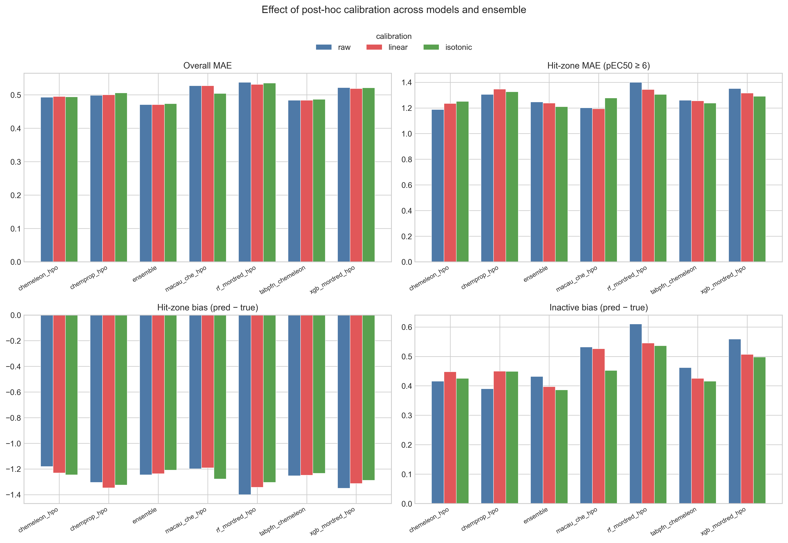
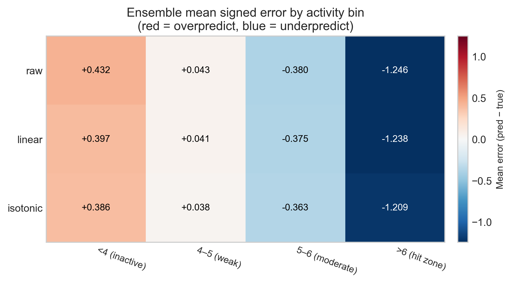
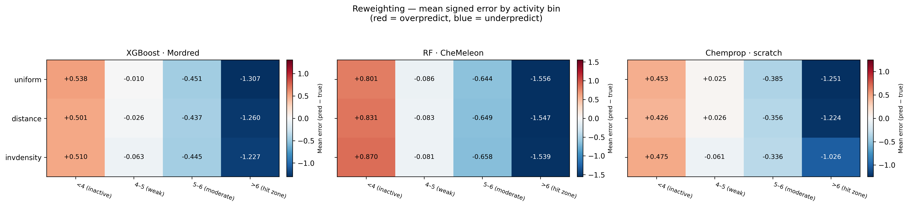
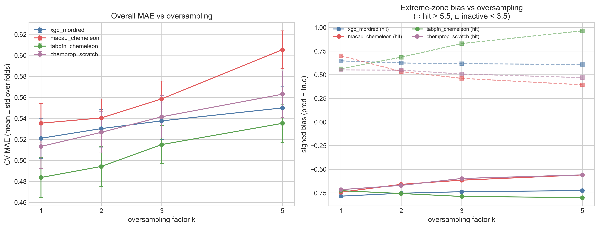
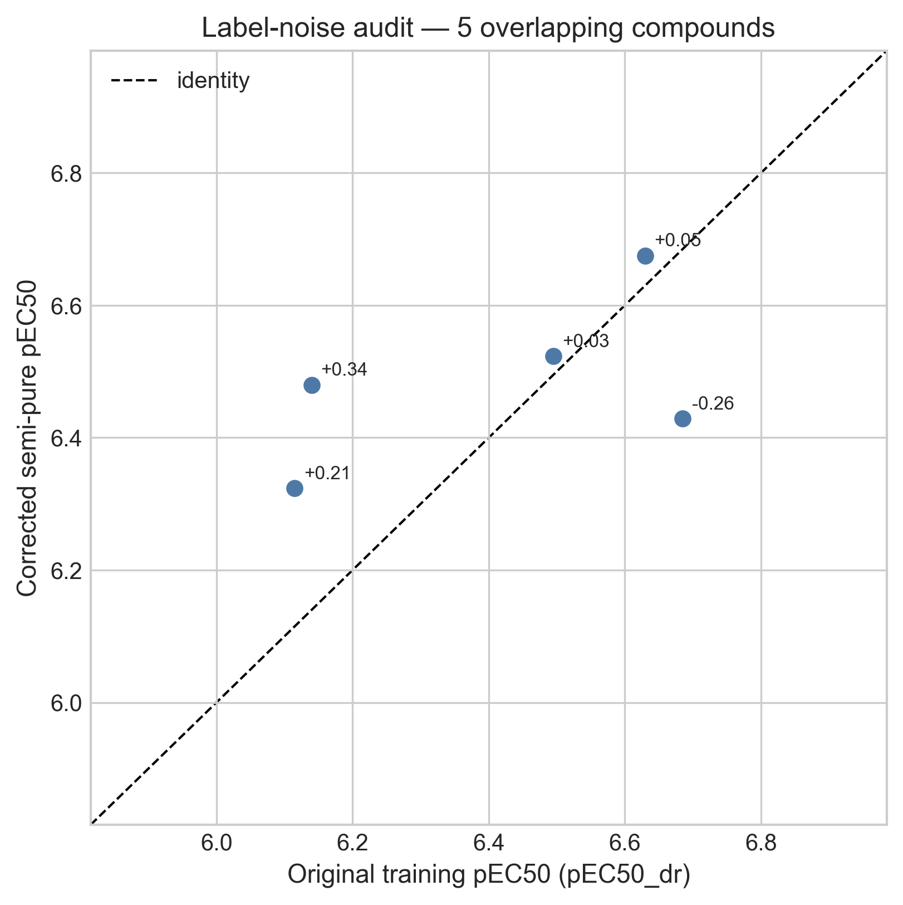
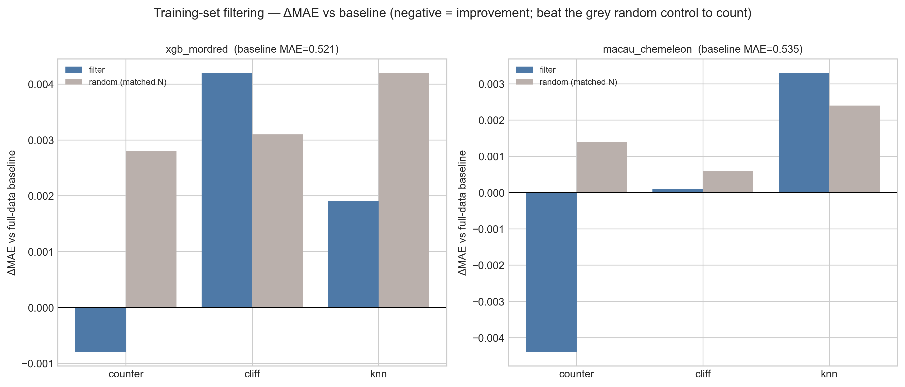
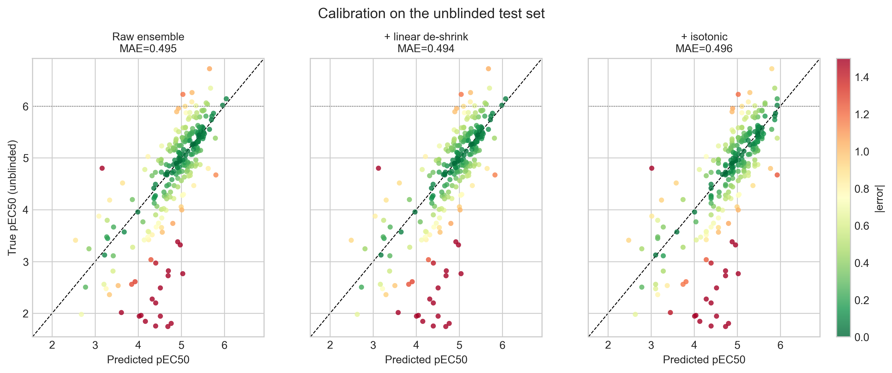

# PXR Challenge #6: Trying to fix the models (and mostly failing)

*June 2026*
Tag: blind challenge

---

At the end of [the unblinding post](2026_06_18_unblinded_analysis.html) I laid out two failure modes the released labels had exposed, and a short list of fixes I wanted to try before the final submission.
This notebook is me actually trying them.
It is also, I should say up front, the post where most of those fixes do not work.

To recap, the two correctable problems were:

1. **Regression to the mean at the activity extremes.** Every model overpredicts inactive compounds and underpredicts the rare potent ones. In the hit zone (pEC50 > 6) the underprediction reached a full log unit.
2. **Unused auxiliary assay data.** Beyond the dose-response labels, OpenADMET had released extra measurements that other participants found useful, and that I had failed to exploit in earlier notebooks.

I tested five concrete remedies. The notebook orders them by mechanism, but they group more naturally into two questions, and that is how I will present them here:

- **Fixing the bias**:  three ways to push the models to commit to the extremes: post-hoc calibration, loss reweighting, and oversampling.
- **Fixing the data**:  two ways to change what the models learn from: adding a small high-quality dataset, and removing unreliable training points.

Then I combine the two interventions that survived into a retrained ensemble and check it against the unblinded labels.

**One rule throughout.** Everything is compared with the same **5×5 cross-validation** used since notebook #2 (random split, seed = 42). To avoid letting the now-known Phase 1 labels drive my choices, only the single best strategy chosen *by CV* is ever applied to the unblinded test set, and its effect there is reported once, for confirmation.

As always the [notebook](https://github.com/adlvdl/pxr_challenge/blob/main/marimo_notebooks/6_ml_optimization_3.py) is available, along with an [HTML version](../html_notebooks/pxr_challenge/6_ml_optimization_3.html) to explore the tables and plots in more detail.

---

## Part 1 — Fixing the bias

All three ideas in this section attack the same target: the models hedge toward the dense middle of the training distribution instead of committing to potent or inactive compounds. They differ only in *when* they intervene: after training, during training, or in the data.

### Post-hoc calibration (de-shrinking)

The cheapest possible fix is a one-dimensional map applied *after* training that pulls predictions back toward the truth: low predictions lower, high predictions higher.
I tested two variants: 
- a **linear** de-shrink: regress true on predicted pEC50; a fitted slope > 1 expands the range 
- an **isotonic** fit: a flexible monotonic map that can also correct curvature

Because calibration is model-agnostic, I could reuse the out-of-fold 5×5 CV predictions already saved in notebook #4 rather than retraining anything.
For each test fold the calibrator is fit on the *sibling* inner folds of the same outer repeat (a disjoint set of compounds) and then applied to the held-out fold, so the process doesn't use the unblinded data.
I ran it for all six component models and for the submitted ensemble (`cp5·ch5·rf0·xg⅓·mc1·tf5`).

*Effect of calibration across models. Each group of three bars is raw / linear / isotonic. Overall MAE (top-left) is essentially unchanged; the bias panels (bottom) move toward zero, but only slightly.*

The honest summary is that calibration barely does anything to overall accuracy.
On the ensemble, CV MAE goes from **0.471** raw to **0.471** linear and **0.474** isotonic: a change in the third decimal place.
The bias panels do move in the right direction: isotonic trims the inactive overprediction (+0.43 → +0.39) and the hit-zone underprediction (−1.25 → −1.21).
But the effect is small, and the reason is structural.
The fitted linear slope tells the same story: it came out at **1.024**, barely above 1, because across the dense middle the ensemble is hardly shrinking at all, so there is almost nothing for a global de-shrink to expand.

*Ensemble signed error by activity bin (red = overprediction, blue = underprediction). De-shrinking nudges the outer columns toward zero but cannot remove the structure.*

### Loss / sample reweighting

Calibration acts after the fact; reweighting changes what the model learns by up-weighting extreme-activity compounds during training.
I compared three schemes:  
- `uniform`: baseline 
- `invdensity`: ∝ 1 / population of the label's pEC50 bin 
- `distance`: 1 + |y − median|, growing toward the extremes

Each scheme is tested on the three models that expose a per-sample loss weight: XGBoost·Mordred, RF·CheMeleon, and a scratch Chemprop D-MPNN. (TabPFN and Macau have no loss weight to set, so they sit this one out.)

This is where the negative result is starkest.
For **every** model, the uniform baseline had the lowest CV MAE; both reweighting schemes made it worse.

| Model | uniform | distance | invdensity |
|---|---|---|---|
| Chemprop · scratch | **0.513** | 0.537 | 0.615 |
| XGBoost · Mordred | **0.521** | 0.530 | 0.547 |
| RF · CheMeleon | **0.590** | 0.596 | 0.606 |

*Reweighting signed error by activity bin. Moving from uniform down to invdensity, the `<4` and `>6` columns barely change while the weak/moderate middle drifts away from zero: error is shifted, not removed.*

The bias heatmap explains why: reweighting *redistributes* error rather than removing it.
Up-weighting the extremes pulls a little bias out of the `>6` and `<4` columns, but it pushes bias *into* the well-populated `4–5` and `5–6` bins, which is where most of the compounds live, so the overall MAE rises.

### Oversampling the extremes

Oversampling is the data-level twin of reweighting: instead of weighting the loss, it simply duplicates the rare extreme compounds in the training fold.
Its one advantage is reach: because it changes the data and not the loss, it works for **every** model, including TabPFN and Macau.
I replicated the active tail (pEC50 > 5.5) and inactive tail (pEC50 < 3.5) by factors of k = 2, 3, 5 and tested four models.

*Oversampling curves. Left: overall MAE climbs with k for every model. Right: the hit-zone bias (circles) creeps toward zero for the tree and message-passing models, but TabPFN (green) gets worse on both axes.*

Same shape of result, drawn as a curve: overall MAE rises monotonically with k for all four models.
The bias panel is more interesting and more nuanced.
For XGBoost, Macau, and Chemprop, oversampling does pull the hit-zone underprediction toward zero (Chemprop's hit-zone bias improves from −0.72 at k = 1 to −0.56 at k = 5), so it *is* a more effective bias lever than calibration was.
But **TabPFN behaves in the opposite way**: its hit-zone bias gets *more* negative and its inactive bias balloons from +0.56 to +0.96 as k grows.
That fits how TabPFN works: it treats the training set as in-context examples, so feeding it many duplicated points distorts the density it conditions on rather than re-weighting a loss.
The lesson is that "oversample the extremes" is not a model-agnostic fix even though it is mechanically applicable to every model.

### Aside

For the purpose of this competition, all three interventions failed because they didn't decrease MAE, the metric on which submissions are scored. 
However, in a drug discovery program, depending on the needs of the program and its success metrics, one or more of these interventions could be worthwhile. 
MAE is a global metric of model performance, but in most scenarios we care more about specific ranges. 
For example, for affinity we are normally interested in highly potent compounds. 
If we bias a model to better predict those compounds, even if the model's MAE is higher, it will be a better model for the program.

---

## Part 2 — Fixing the data

The first three ideas all left the training labels alone and changed how the model treated them. The next two change the data itself: one adds points, one removes them.

### Extra assay data (the 96-compound semi-pure set)

OpenADMET released a small, additional dataset: 96 compounds re-measured from **semi-pure** microscale synthesis with purity-corrected pEC50 values (94 usable, spanning pEC50 4.0–7.0, exactly the moderate-to-hit range where the models struggle).
Only **5 of them overlap** the dose-response training set, so they are almost all genuinely new measurements.

Before using them as training data, those 5 overlapping compounds are worth a detour, because they let me put a number on the label noise.

*Label-noise audit. For the five compounds measured twice, the corrected value differs from the original training label by 0.18 log units on average: a floor on the error no model can beat.*

The mean absolute discrepancy between the original and corrected labels is **0.18 log units**.
That is a small but real number, and a useful one: the best ensemble CV MAE is ≈ 0.47, so a non-trivial slice of the residual error is simply measurement noise in the labels, not something a better model could ever fix.
It is the most valuable thing to come out of this dataset.
However, because it is based only on 5 compounds and on different experiments, it should be taken with a grain of salt. 

As for using the 94 compounds to *augment* training, they help, but barely, because 94 new points is only a ~2% increase over the 4,138-compound dose-response training set.
XGBoost·Mordred improves from **0.521** to **0.519**, RF·CheMeleon from **0.590** to **0.586**.
Real, in the right direction, and almost too small to care about.

### Filtering the training set

The mirror image of augmentation is to *remove* likely-unreliable training points and ask whether a cleaner set generalizes better.
I tested three filters, each dropping ≈10% of the training fold: 
- `counter`: drop compounds whose counter-screen pEC50 ≥ their PXR pEC50, i.e. non-selective hits 
- `cliff`: drop the member of each activity-cliff pair whose activity is nearer the mean  
- `knn`: drop the points whose pEC50 deviates most from their five nearest neighbors

The trap with any filtering experiment is that removing data changes performance even when the removal is random, so every filter is paired with a **size-matched random-removal control**.
A filter only counts if it beats *both* the full-data baseline *and* its random twin.

*Training-set filtering. A blue bar must be below zero (beat the full-data baseline) AND below its gray twin (the gain is from cleaning, not from less data). Only the `counter` filter manages both.*

By that stricter bar, only one filter survives: **counter-screen filtering**.
For both models it lowers MAE below the baseline (XGBoost 0.521 → 0.520, Macau 0.535 → 0.531) *and* beats its random control, whereas `cliff` and `knn` are no better (and sometimes worse) than dropping the same number of rows at random.
That is mechanistically satisfying: removing compounds whose activity is not PXR-specific takes out genuinely misleading labels, while the cliff and kNN heuristics mostly just throw away informative data.
The gain is tiny, but unlike everything in Part 1, it is a real signal and not a redistribution.

---

## Part 3 — Putting the survivors together

Stepping back, here is the CV-MAE improvement of the best variant of each strategy over its own baseline. Comparing absolute MAE across the rows would be unfair (calibration operates on the strong ensemble while the others operate on weaker single models), so the fair currency is the *change* each strategy buys.

| Strategy (best variant) | Model | ΔMAE vs own baseline |
|---|---|---|
| Counter-filtering | Macau · CheMeleon | **−0.0044** |
| + semi-pure data | RF · CheMeleon | −0.0036 |
| + semi-pure data | XGBoost · Mordred | −0.0019 |
| Counter-filtering | XGBoost · Mordred | −0.0008 |
| Calibration (linear) | Ensemble | −0.0001 |
| Reweighting / oversampling | (all models) | 0.000 or worse |

Two things stand out.
First, the largest improvement *anything* produced was −0.0044 MAE, from counter-filtering; and that was on a single component model weaker than the ensemble, so it is not directly something I can ship.
Second, the only intervention that operates *directly* on the submitted ensemble is calibration, and its best CV variant (linear) buys −0.0001, which is to say, nothing.
So the strategy applied to the submission, honoring the CV-only rule, is the best-by-CV calibration; and the best-by-CV calibration is "barely distinguishable from doing nothing."

The two data-level survivors (counter-filtering and the semi-pure augmentation) only pay off if I *rebuild* the whole ensemble on the cleaned, augmented data.
So that is the last experiment: retrain all five components on the counter-filtered + semi-pure-augmented training set, re-weight them with the original mixture, and evaluate on the unblinded labels.

First, the calibration question on the held-out set, since it is the one move I could make to the existing submission:

*Calibration on the unblinded test set. The decision-relevant question is the hit zone (above the dotted line): isotonic pulls the worst underpredictions up a little, at a hair's cost to overall MAE.*

On the unblinded set the raw ensemble scores MAE **0.4948**.
Linear de-shrink nudges it to **0.4936**; isotonic moves overall MAE the wrong way to **0.4957** but does the most for the hit zone, lifting its underprediction bias from −0.65 to −0.61.
These are all within noise of each other, consistent with what the CV predicted, and a reminder that a global calibration was never going to rescue an activity-conditional bias.

The retrained ensemble does slightly better, and it is the one genuine (if modest) win in the whole notebook:

| Ensemble | MAE | R² | ρ | Hit-zone bias |
|---|---|---|---|---|
| Original (notebook #4 submission) | 0.4948 | 0.493 | 0.784 | −0.650 |
| **Counter-filtered + semi-pure (default params)** | **0.4916** | **0.497** | **0.786** | **−0.601** |
| Counter-filtered + semi-pure (HPO params) | 0.4955 | 0.476 | 0.783 | −0.614 |

Retraining the default-parameter ensemble on the cleaned and augmented data improves MAE from **0.4948 to 0.4916**, with a small bump in R² and rank correlation and a slightly less severe hit-zone underprediction.
Curiously, the HPO-tuned variant is *worse* than the default one here: the hyperparameters tuned on the original training set do not transfer cleanly to the modified one, which is its own small cautionary tale.
The improvement is about 0.003 MAE. It is real, it survived to the held-out set, and it is roughly the size of the label noise I measured earlier, which is about as much as I should have expected.

---

## What I take from this

The headline is a negative result, and I think it is an honest and useful one.
Of five plausible fixes, three (calibration, reweighting, oversampling) failed to improve overall accuracy, and two (extra data, filtering) helped only marginally.
But the *reasons* they failed are the interesting part:

- The regression-to-the-mean bias is **conditional on activity**, so a single global calibration map (the obvious first thing to reach for) is structurally unable to remove it.
- Reweighting and oversampling do not remove error, they **relocate** it from the dense middle to the sparse extremes; whether that trade is worth making is a question about the use case, not the MAE.
- Oversampling is **not model-agnostic** even when it is mechanically applicable: TabPFN got worse because duplicating points corrupts the very thing an in-context model conditions on.
- A real chunk of the residual error is **irreducible label noise** (~0.18 log units), which no amount of modeling can touch.
- The one data intervention that beat its random control (dropping non-PXR-specific hits) worked because it removed genuinely **misleading** labels rather than merely shrinking the training set.

This is the **last notebook I will spend trying to improve the submission**.
The competition closes on July 1, so my predictions are now locked.
I expect to write at least one more notebook once those final labels are released, focused on analyzing how the models actually did on analog set 2, the half I never got to see. 
Further out, I plan to write a proper retrospective on the whole PXR challenge: what worked, what I would do differently, and whether the blind format changed any of my conclusions.

If you reached the end, thank you for following this series as far as you have.
If you have a fix I should have tried, especially anything that targets the activity-conditional bias more cleverly than a global map, I would genuinely like to hear it in the comments below.
