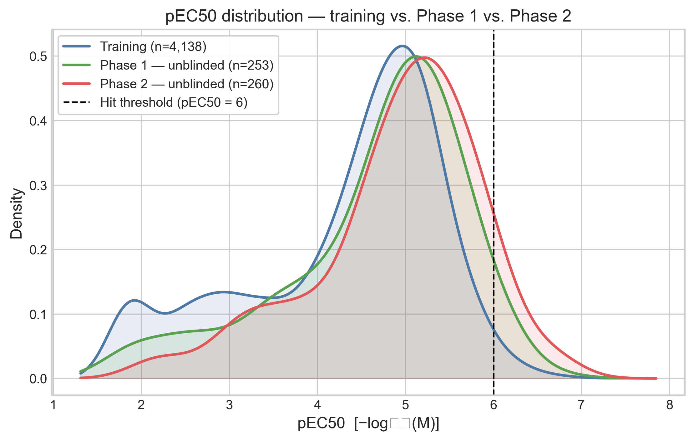
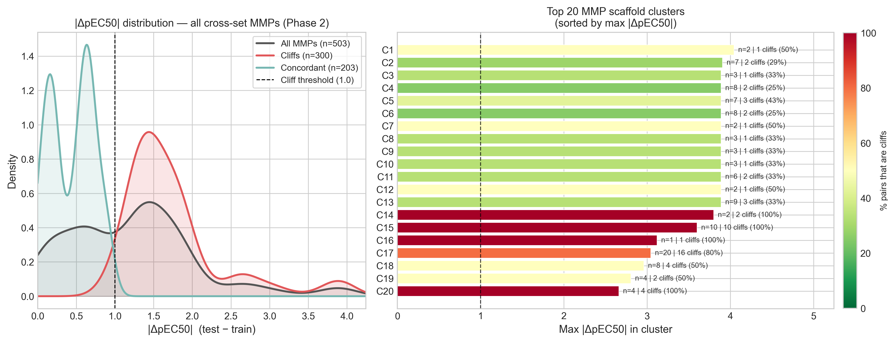
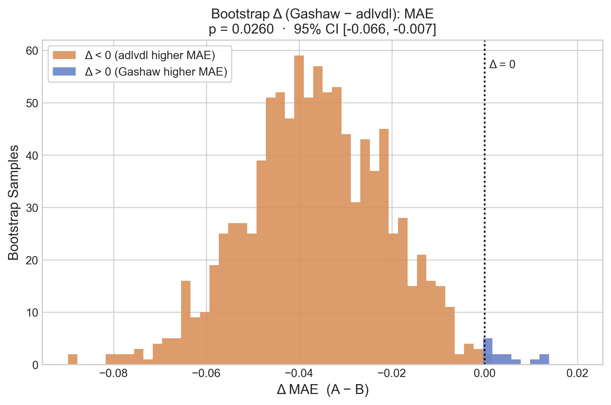
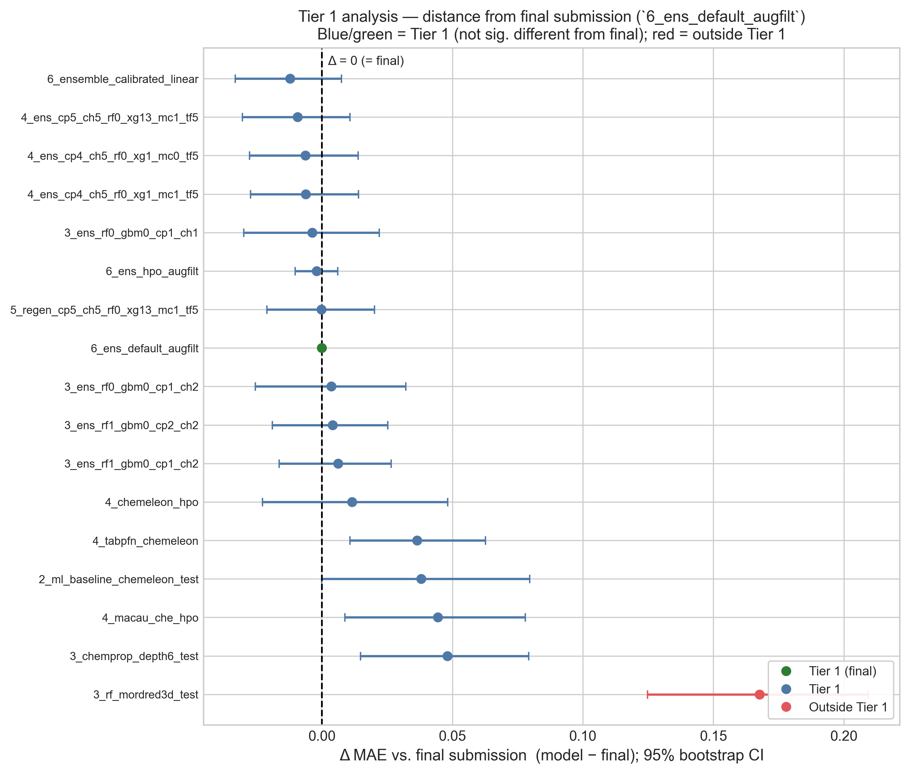
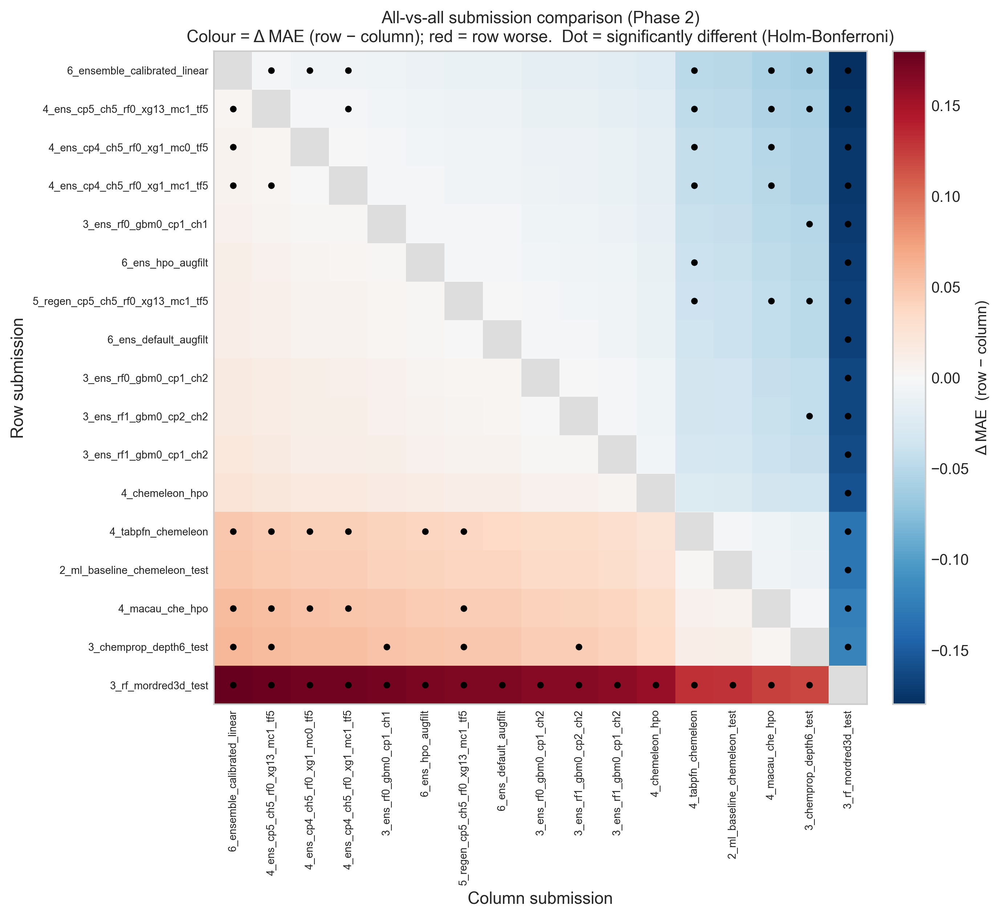
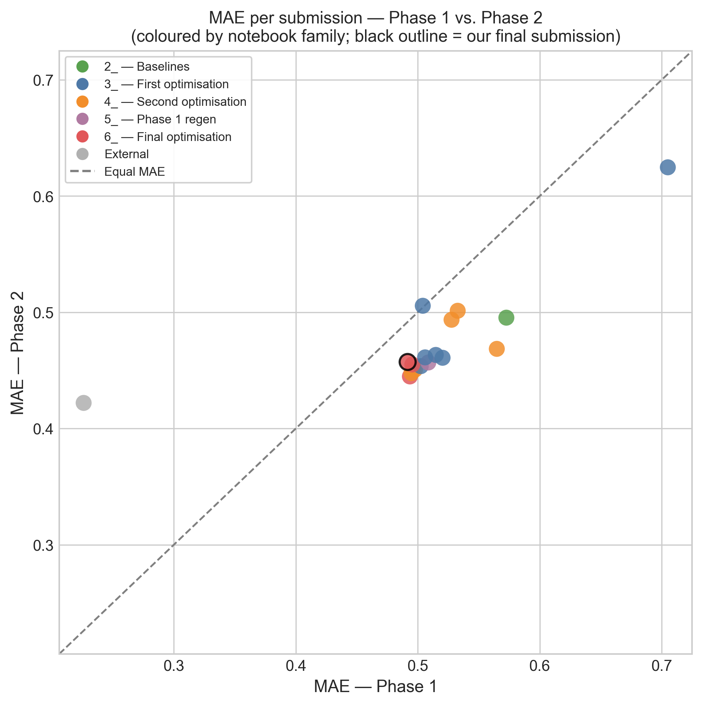
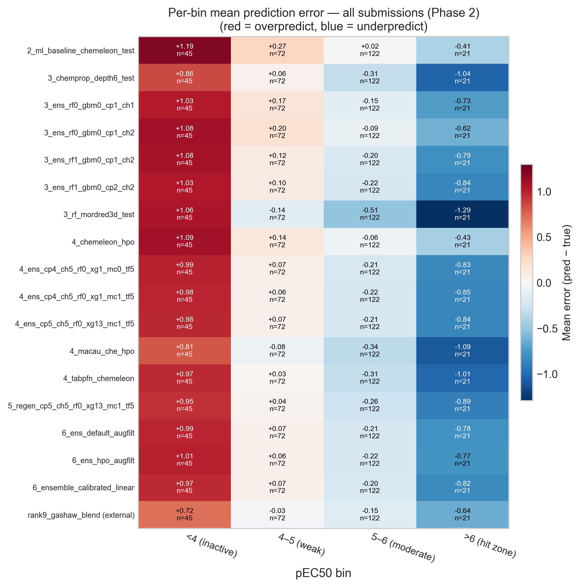

# PXR Challenge #7: Picking the wrong submission (and why it barely mattered)

*July 2026*
Tag: blind challenge

---

The challenge is over.
The organizers have released the labels for analog set 2, the 260 compounds of Phase 2 that stayed hidden the whole time, and the [final leaderboard](https://huggingface.co/spaces/openadmet/pxr-challenge) is out.
I finished at rank 46.

This post is the post-mortem, and it turned out less flattering than I expected when I started writing it.

In this post I will cover:
- how the Phase 2 test set differs from Phase 1
- the final ranking of all seventeen submissions I produced
- how a 0.004 MAE difference on Phase 1 sent me to the wrong choice
- a paired bootstrap analysis showing that sixteen of my seventeen submissions are statistically indistinguishable
- what that implies about the optimization work that produced them

As always, the code of the [notebook](https://github.com/adlvdl/pxr_challenge/blob/main/marimo_notebooks/7_unblinded_phase2_analysis.py) is available as well as an [HTML version](../html_notebooks/pxr_challenge/7_unblinded_phase2_analysis.html) to explore the tables and interactive plots in more detail.

---

## Part 1 — What the Phase 2 test set looks like

The first thing to check is whether the two test sets probe the same chemistry.
In [the Phase 1 post](2026_06_18_unblinded_analysis.html) I was surprised that the unblinded test set sat almost exactly on top of the training distribution, when I had expected an analog set to be enriched for potency.
Phase 2 moves the needle further compared to Phase 1.

*pEC50 distributions for the training set (n = 4,138), Phase 1 (n = 253) and Phase 2 (n = 260). The Phase 2 curve is shifted to the right and has more mass past the dashed hit threshold.*

The shift is small in the median but larger in the tail.

| | Training | Phase 1 | Phase 2 |
|---|---|---|---|
| n compounds | 4,138 | 253 | 260 |
| Median pEC50 | 4.65 | 4.90 | 5.08 |
| Std pEC50 | 1.12 | 1.03 | 0.94 |
| Hits (pEC50 ≥ 6) | 1.6% | 4.0% | **8.1%** |

The hit fraction doubles from Phase 1 to Phase 2, and it is five times the training rate.
The activity distribution in Phase 2 is also a bit narrower than the training set (std 0.94 against 1.12), so the compounds are packed more tightly around a higher center.
This is closer to what I expected an analog follow-up set to look like back in June.

The activity cliffs are the more important part.
Using the nearest-neighbor definition I have used since before — a test compound within ECFP4 Tanimoto 0.4 of a training compound, but differing by at least 1 log unit in potency — Phase 2 looks only slightly worse than Phase 1, with 127 of 260 compounds (48.8%) classified as cliffs against 46.2% in Phase 1.
Structural coverage is essentially complete: 99.2% of Phase 2 compounds have a close training analog.

The matched molecular pair (MMP) view is much less reassuring.
An MMP is a pair of compounds differing by exactly one structural edit on a shared scaffold, so unlike whole-molecule similarity it attributes a potency change to a specific chemical modification.

*Cross-set matched molecular pairs for Phase 2 (one training compound, one test compound). Of 503 pairs, 60% cross the 1 log unit cliff threshold, nearly double the Phase 1 rate.*

Of 503 cross-set pairs, **300 (59.6%) are activity cliffs**, against 139 of 399 (34.8%) in Phase 1.
The median potency gap between MMP partners nearly doubles, from 0.79 to 1.36 log units, and 62 of 108 scaffold clusters contain at least one cliff.
So the median matched pair in Phase 2 is a cliff, which was not true in Phase 1.

This is a curious combination.
Phase 2 is structurally closer to the training set than Phase 1 was, but much more cliff-dense.
At the same time, as we will see later, performance on Phase 2 was generally better than in Phase 1.

---

## Part 2 — The final ranking

I analyzed all seventeen submissions generated in previous notebooks, taking the 260 Phase 2 compounds and scoring them against the truth.
For reference I also scored one external submission from another participant (Gashaw) that he made available in his [repository](https://github.com/gashawmg/openadmet-pxr-pec50-challenge#repo-contents).
It finished at rank 12; the file is named `rank9_...` because it sat at rank 9 when I downloaded it, before late submissions were included in the leaderboard.

| Rank | Submission | MAE | RMSE | R² | ρ | Bias |
|---|---|---|---|---|---|---|
| — | *rank9_gashaw_blend (external)* | *0.4220* | *0.632* | *0.550* | *0.804* | *−0.008* |
| 1 | `6_ensemble_calibrated_linear` | **0.4448** | 0.656 | 0.515 | 0.797 | +0.024 |
| 2 | `4_ens_cp5_ch5_rf0_xg13_mc1_tf5` | 0.4477 | 0.659 | 0.511 | 0.797 | +0.019 |
| 3 | `4_ens_cp4_ch5_rf0_xg1_mc0_tf5` | 0.4506 | 0.662 | 0.507 | 0.796 | +0.026 |
| 4 | `4_ens_cp4_ch5_rf0_xg1_mc1_tf5` | 0.4508 | 0.661 | 0.508 | 0.795 | +0.016 |
| 5 | `3_ens_rf0_gbm0_cp1_ch1` | 0.4536 | 0.667 | 0.499 | 0.777 | +0.096 |
| 6 | `6_ens_hpo_augfilt` | 0.4551 | 0.666 | 0.500 | 0.791 | +0.028 |
| 7 | `5_regen_cp5_ch5_rf0_xg13_mc1_tf5` | 0.4568 | 0.661 | 0.509 | 0.794 | −0.020 |
| **8** | **`6_ens_default_augfilt` (submitted)** | **0.4573** | 0.665 | 0.502 | 0.781 | +0.026 |
| 9 | `3_ens_rf0_gbm0_cp1_ch2` | 0.4609 | 0.675 | 0.486 | 0.771 | +0.150 |
| 10 | `3_ens_rf1_gbm0_cp2_ch2` | 0.4612 | 0.667 | 0.499 | 0.787 | +0.037 |
| 11 | `3_ens_rf1_gbm0_cp1_ch2` | 0.4633 | 0.669 | 0.496 | 0.787 | +0.063 |
| 12 | `4_chemeleon_hpo` | 0.4685 | 0.684 | 0.473 | 0.766 | +0.162 |
| 13 | `4_tabpfn_chemeleon` | 0.4936 | 0.706 | 0.439 | 0.734 | −0.051 |
| 14 | `2_ml_baseline_chemeleon_test` | 0.4954 | 0.724 | 0.409 | 0.743 | +0.257 |
| 15 | `4_macau_che_hpo` | 0.5013 | 0.708 | 0.436 | 0.710 | −0.131 |
| 16 | `3_chemprop_depth6_test` | 0.5056 | 0.709 | 0.434 | 0.703 | −0.064 |
| 17 | `3_rf_mordred3d_test` | 0.6247 | 0.811 | 0.259 | 0.635 | −0.198 |

The submission I actually sent, `6_ens_default_augfilt`, comes out at MAE 0.4573, eighth of seventeen and in the middle of my own pack.
The best was `6_ensemble_calibrated_linear` at 0.4448.

Two things in that table caught my attention.

The first is what sits at the top.
`6_ensemble_calibrated_linear` is the linearly calibrated ensemble, which is the intervention I spent a third of notebook #6 on and then dismissed, because in cross-validation it improved MAE by 0.0001.
I wrote at the time that it was "barely distinguishable from doing nothing".
But in Phase 2 data, it was my best submission.

The second is where the first model I ever trained ended up.
`2_ml_baseline_chemeleon_test` at position 14 is the off-the-shelf CheMeleon from [notebook #2](2026_04_22_ml_baseline.html), with default settings and no tuning at all.
It scores MAE 0.4954 against my final ensemble's 0.4573.
Several months of hyperparameter optimization, ensembling, data augmentation and counter-screen filtering bought 0.038 MAE over a model I trained in an afternoon.
Whether that 0.038 is real is the subject of Part 4.

---

## Part 3 — How I picked the wrong submission

At the end of notebook #6 I had three finalists, all ensembles retrained on the counter-filtered and semi-pure-augmented training data:

- `6_ens_default_augfilt` — default hyperparameters
- `6_ens_hpo_augfilt` — the HPO-tuned variant
- `6_ensemble_calibrated_linear` — the linearly de-shrunk ensemble

Phase 1 was unblinded at that point, so I evaluated all three on it and submitted the winner.
Below is that decision with the Phase 2 column I could not see at the time.

| Submission | MAE Phase 1 | MAE Phase 2 |
|---|---|---|
| `6_ens_default_augfilt` **(submitted)** | **0.4916** (1st) | 0.4573 (**3rd**) |
| `6_ensemble_calibrated_linear` | 0.4936 (2nd) | **0.4448** (1st) |
| `6_ens_hpo_augfilt` | 0.4955 (3rd) | 0.4551 (2nd) |

The ordering is exactly reversed.
Phase 1 ranked them 1-2-3 and Phase 2 ranked them 3-1-2, so the submission Phase 1 liked best is the one Phase 2 liked least.

It would be easy to call this bad luck, but I think the more useful reading is that there was never any signal to select on in the first place.
The three Phase 1 scores span 0.0039 MAE, from 0.4916 to 0.4955.
That is a difference in the third decimal place, measured on 253 compounds.
A single reshuffled compound could have flipped that ranking.
Sorting three models by a column that is essentially noise gives you a random ordering, and a random ordering of three items lands on the worst one a third of the time.

So the mistake was not that I trusted Phase 1 over cross-validation.
It was that I treated a difference as a ranking without checking whether the difference was larger than its own uncertainty.
That is the question the rest of the post is about.

It is worth being clear about the practical stakes before going on.
My submission at MAE 0.4573 placed 46th on the final leaderboard, and the calibrated ensemble at 0.4448 would have placed 41st.
Five positions, for correctly resolving a choice I have just argued was not resolvable with the information I had at the time.

---

## Part 4 — Almost none of my submissions are distinguishable

If a 0.004 MAE gap on Phase 1 was noise, the next question is how large a gap has to be before it isn't.
The challenge organizers describe the significance test they use in [*Peak performance or just noise?*](https://openadmet.ghost.io/peak-performance-or-just-noise/), so I reproduced their procedure here to keep my numbers comparable to theirs.

The method is a **paired bootstrap**.
You draw 1,000 pseudo-test sets by resampling the 260 Phase 2 compounds with replacement, using the same resampled indices for both submissions being compared.
Because each iteration scores both models on the same compounds, the comparison is paired and the varying difficulty of individual compounds largely cancels out.
For each iteration you compute both MAEs and their difference Δ, which gives a bootstrap distribution of Δ, and the two-tailed p-value is twice the smaller tail of that distribution.
Since I am making all 136 pairwise comparisons among my 17 submissions at once, the p-values then need a **Holm-Bonferroni** step-down correction for multiple testing.

Before applying any of this to my own submissions, I wanted to check that my implementation was correct.
OpenADMET provide a head-to-head comparison app on the challenge page that runs this test between any two participants, so I could use it as a control: I reproduced the comparison between the external Gashaw blend and my own final submission, and checked my numbers against the ones the app reports.

*Paired bootstrap of ΔMAE between the external blend and my final submission. The distribution sits almost entirely below zero, so the external model really is better on this set, but the difference does not clear the corrected threshold.*

My implementation gives p = 0.0260 with a 95% CI of [−0.066, −0.007], which matches what the app reports for that pair.
The correction matters a lot here: the challenge had 95 participants, which means 4,465 pairwise comparisons, and at this pair's position in the sorted p-values the Holm-Bonferroni threshold works out to 0.000025.
So even a model 0.035 MAE better than mine, from someone who finished 34 places above me, is not statistically distinguishable from mine on 260 compounds.
The organizers later changed the correction performed to not be as strict and that pushed my submission from Tier 1 to Tier 2.

With that checked, I anchored the analysis on the submission I actually sent and asked which of the others are significantly different from it.

*Each point is one submission's mean ΔMAE against my final submission, with its 95% paired-bootstrap confidence interval. An interval crossing the dashed zero line means the submission cannot be distinguished from what I sent. Only the RF/Mordred baseline at the bottom is separated from it.*

**Sixteen of my seventeen submissions are not significantly different from the one I submitted.**
The only exception is `3_rf_mordred3d_test`, the Random Forest on Mordred descriptors, which is worse by 0.168 MAE.
Everything else falls inside the noise band: the untuned baseline from notebook #2, every ensemble from notebooks #3 through #6, and the best submission that I failed to pick.

The three comparisons this post revolves around:

| Comparison | ΔMAE | 95% CI | p | Significant? |
|---|---|---|---|---|
| Best (`6_ensemble_calibrated_linear`) vs. submitted | −0.0121 | [−0.033, +0.008] | 0.262 | No |
| Untuned baseline (`2_ml_baseline...`) vs. submitted | +0.0380 | [−0.000, +0.080] | 0.052 | No |
| RF/Mordred vs. submitted | +0.1677 | [+0.125, +0.209] | <0.001 | **Yes** |

The submission I should have sent is not statistically better than the one I did send (p = 0.262).
The one I did send is also not statistically better than the untuned baseline from April (p = 0.052, and that is before the multiple-comparison correction, which pushes the threshold it would need to clear down to 0.0007).

The all-versus-all view shows the same thing across every pair at once.
Of the 136 comparisons only 36 are significant, and they are nearly all comparisons against the two or three genuinely weak single models.

*All-versus-all comparison, submissions ordered best to worst. Color is the signed MAE difference and a dot marks a Holm-Bonferroni significant pair. The block in the middle, every ensemble against every other ensemble, is almost entirely free of dots.*

One detail of this test is worth explaining, because it produces a result that looks odd at first.
Significance depends on the variance of the paired difference Δ, not on the size of the raw MAE gap.
Submissions that share components are highly correlated with each other, so their Δ has a narrow confidence interval and even a small consistent gap can come out significant.
A structurally different model has a much wider Δ interval and can survive a larger gap.
This is why `4_tabpfn_chemeleon` (Δ = +0.037, p = 0.006 uncorrected) looks more separated from my final submission than the untuned baseline does (Δ = +0.038, p = 0.052), despite an almost identical MAE gap.
Neither of them survives the correction.

---

## Part 5 — What does separate, and what the errors look like

None of this means every model is equally good, and it is worth being precise about what the analysis does and does not show.

The ranking is not noise across the board.
Scoring every submission against both test sets and comparing the two MAE rankings gives a Spearman rank correlation of **0.797**, so the submissions that did well on one half generally did well on the other.

*MAE on Phase 1 against Phase 2 for every submission. Almost everything sits below the diagonal, so Phase 2 was easier for my models, and the broad ordering is preserved. The grey point on the far left is the external blend.*

So there is real signal separating the tuned ensembles from the RF/Mordred baseline, and it replicates across two independent test sets.
What there is not is enough signal to separate the ensembles from each other, or from a reasonable off-the-shelf model.
The differences that survive are the coarse ones, and most of my optimization work was spent on finer differences than that.

The external blend behaves differently from everything else here.
It is the only submission whose Phase 2 MAE is much worse than its Phase 1 MAE, going from 0.226 to 0.422, a jump of +0.196, while every one of my submissions improved by roughly 0.05.
Phase 1 is the half that was visible on the live leaderboard during the challenge.
A model that is excellent on the visible half and merely good on the hidden half looks like leaderboard overfitting to me, though with a single submission I cannot say that with much confidence.

The errors themselves have not changed character since Phase 1.
Splitting my final submission's errors by nearest-neighbor class gives the following.

| NN class | n | Mean \|error\| | Mean signed error | \|error\| > 1 |
|---|---|---|---|---|
| Activity cliff | 127 | **0.553** | **+0.359** | 20 (15.7%) |
| Similar / concordant | 131 | 0.368 | −0.294 | 6 (4.6%) |
| Dissimilar | 2 | 0.193 | −0.193 | 0 |

The overall mean absolute error is 0.457.
Cliffs are predicted about 50% worse than concordant compounds, and the signs of the two are opposite: cliffs are overpredicted by +0.36 on average, while concordant compounds are underpredicted by −0.29.
This is the same mechanism I described in Phase 1, where a test compound much less active than its nearest training analog gets pulled up toward the analog the model already knows, and it is now measured on a set where 60% of matched pairs are cliffs.

The activity-conditional bias is unchanged too, and it shows up in every submission.

*Mean signed error per submission and activity bin (red = overprediction, blue = underprediction). Every row has the same structure, red on the left and blue on the right. The bottom row is the external blend, which has it as well.*

All eighteen submissions scored here overpredict the inactive bin, by between +0.72 and +1.19, and underpredict the hit zone, by between −0.41 and −1.30.
That includes the external blend, which was built by someone with a better model than mine.
After three notebooks of trying to remove this bias with calibration, reweighting, oversampling, data augmentation and filtering, I think the most likely explanation is that it is a property of the problem rather than of my modeling choices: a regression model trained on a distribution centered near pEC50 5 will hedge toward that center.

---

## What I take from this

The selection mistake is real and I would do it differently now.
Choosing between three near-identical candidates on a 0.004 MAE difference was not really a judgment call, it was a coin flip that I treated as a measurement.
The fix is not to trust cross-validation instead of Phase 1, because CV had already told me these three models were the same to within 0.001.
The fix is to compute the confidence interval before ranking anything, and when the candidates turn out to be indistinguishable, to choose on some other criterion than the metric: simplicity, or behavior in the region I actually care about.
By that second standard the calibrated ensemble was arguably the better pick anyway, since it was the only one of the three doing anything deliberate about the hit-zone bias.

The larger result is the one I was not looking for.
Sixteen of seventeen submissions, from an untuned April baseline to a counter-filtered, augmented and hyperparameter-optimized ensemble, cannot be told apart on 260 compounds.
Most of the improvements I reported in notebooks #3, #4 and #6 live inside the confidence interval of the final evaluation.
I don't think the work was wasted, and I still think the ensembling and the data cleaning were reasonable things to do, but I can't really say that the specific model I submitted was better than the ones I discarded.

Knowing what I now know, I could have done things differently.
Instead of spending months narrowing down a field of models whose differences were never resolvable at this sample size, I could have spent that effort on what the error analysis has been pointing at since Phase 1.
Cliffs and the activity-conditional bias account for the errors that matter, and no amount of model selection touched either of them.
A model that predicts an honest interval instead of a point estimate, or one built specifically to be right in the hit zone, would have been a more interesting submission than my eighth-best ensemble, even at the same MAE.

---

## Next steps

This closes the analysis of the challenge itself.
My predictions are locked, all the labels are public, and there is nothing left to compute against them.

I still plan to write the retrospective I promised at the end of the previous post, stepping back from the numbers to what the blind format itself taught me. This post has provided most of the uncomfortable material for it.

If you reached the end, thank you for following this series through all seven notebooks.
The question I would most like to hear opinions on is whether there is a model-selection procedure that would have done better than what I did, given a test set this small and this cliff-dense.
My suspicion is that the answer is to select on something other than MAE, but I would be glad to hear other ideas in the comments below.
